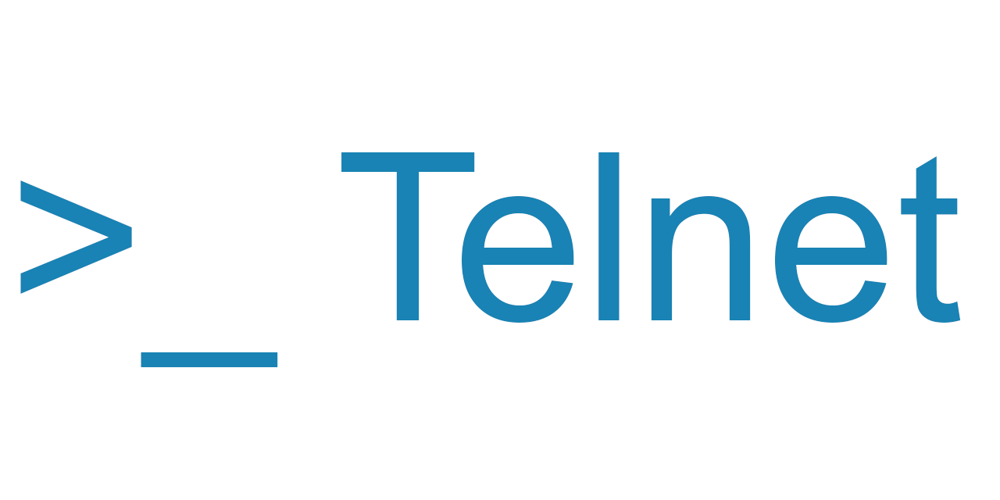

[](https://discord.gg/SK2cWERJF7) [](https://github.com/HarryCordewener/TelnetNegotiationCore/actions/workflows/dotnet.yml) [](https://www.nuget.org/packages/TelnetNegotiationCore)


# Telnet Negotiation Core
## Summary 
This project provides a library that implements telnet functionality, and as many of its RFCs are viable, in a testable manner. 
This is done with an eye on MUDs at this time, but may improve to support more terminal capabilities as time permits and if there is ask for it.

The library now features a modern plugin-based architecture with System.Threading.Channels for high-performance async processing, making it suitable for production use with proper backpressure handling and DOS protection.

## State
This library is in a stable state. The legacy API remains fully supported for backward compatibility, while a new plugin-based architecture is available for modern applications.

## Support
| RFC                                                 | Description                        | Supported  | Comments           |
| --------------------------------------------------- | ---------------------------------- |------------| ------------------ |
| [RFC 855](http://www.faqs.org/rfcs/rfc855.html)     | Telnet Option Specification        | Full       |                    |
| [RFC 1091](http://www.faqs.org/rfcs/rfc1091.html)   | Terminal Type Negotiation          | Full       |                    |
| [MTTS](https://tintin.mudhalla.net/protocols/mtts)  | MTTS Negotiation (Extends TTYPE)   | Full       |                    |
| [RFC 1073](http://www.faqs.org/rfcs/rfc1073.html)   | Window Size Negotiation (NAWS)     | Full       |                    |
| [GMCP](https://tintin.mudhalla.net/protocols/gmcp)  | Generic Mud Communication Protocol | Full       |                    |
| [MSSP](https://tintin.mudhalla.net/protocols/mssp)  | MSSP Negotiation                   | Full       |                    |
| [RFC 885](http://www.faqs.org/rfcs/rfc885.html)     | End Of Record Negotiation          | Full       |                    | 
| [EOR](https://tintin.mudhalla.net/protocols/eor)    | End Of Record Negotiation          | Full       |                    |
| [MSDP](https://tintin.mudhalla.net/protocols/msdp)  | Mud Server Data Protocol           | Partial    | Partial Tested     |
| [RFC 2066](http://www.faqs.org/rfcs/rfc2066.html)   | Charset Negotiation                | Partial    | No TTABLE support  |
| [RFC 858](http://www.faqs.org/rfcs/rfc858.html)     | Suppress GOAHEAD Negotiation       | Full       |                    |
| [RFC 1572](http://www.faqs.org/rfcs/rfc1572.html)   | New Environment Negotiation        | Full       |                    |
| [MNES](https://tintin.mudhalla.net/protocols/mnes)  | Mud New Environment Negotiation    | Full       | Via MTTS flag 512  |
| [MCCP](https://tintin.mudhalla.net/protocols/mccp)  | Mud Client Compression Protocol    | No         | Rejects            |
| [RFC 1950](https://tintin.mudhalla.net/rfc/rfc1950) | ZLIB Compression                   | No         | Rejects            |
| [RFC 857](http://www.faqs.org/rfcs/rfc857.html)     | Echo Negotiation                   | No         | Rejects            |
| [RFC 1079](http://www.faqs.org/rfcs/rfc1079.html)   | Terminal Speed Negotiation         | No         | Rejects            |
| [RFC 1372](http://www.faqs.org/rfcs/rfc1372.html)   | Flow Control Negotiation           | No         | Rejects            |
| [RFC 1184](http://www.faqs.org/rfcs/rfc1184.html)   | Line Mode Negotiation              | No         | Rejects            |
| [RFC 1096](http://www.faqs.org/rfcs/rfc1096.html)   | X-Display Negotiation              | No         | Rejects            |
| [RFC 1408](http://www.faqs.org/rfcs/rfc1408.html)   | Environment Negotiation            | No         | Rejects            | 
| [RFC 2941](http://www.faqs.org/rfcs/rfc2941.html)   | Authentication Negotiation         | No         | Rejects            |
| [RFC 2946](http://www.faqs.org/rfcs/rfc2946.html)   | Encryption Negotiation             | No         | Rejects            |

## ANSI Support, ETC?
Being a Telnet Negotiation Library, this library doesn't give support for extensions like ANSI, Pueblo, MXP, etc at this time.

## Use

### Modern Plugin-Based API (Recommended)

The library uses a modern, type-safe plugin architecture with fluent configuration:

```csharp
using TelnetNegotiationCore.Builders;
using TelnetNegotiationCore.Protocols;

// Create interpreter with fluent plugin configuration
var telnet = await new TelnetInterpreterBuilder()
    .UseMode(TelnetInterpreter.TelnetMode.Server)
    .UseLogger(logger)
    .OnSubmit((data, encoding, telnet) => HandleSubmitAsync(data, encoding, telnet))
    .OnNegotiation((data) => WriteToNetworkAsync(data))
    .AddPlugin<NAWSProtocol>()
        .OnNAWS((height, width) => HandleWindowSizeAsync(height, width))
    .AddPlugin<GMCPProtocol>()
        .OnGMCPMessage((msg) => HandleGMCPAsync(msg.Package, msg.Info))
    .AddPlugin<MSDPProtocol>()
        .OnMSDPMessage((telnet, data) => HandleMSDPAsync(telnet, data))
    .AddPlugin<MSSPProtocol>()
        .OnMSSP((config) => HandleMSSPAsync(config))
        .WithMSSPConfig(() => new MSSPConfig
        {
            Name = "My MUD Server",
            UTF_8 = true,
            Gameplay = ["Fantasy", "Adventure"]
        })
    .AddPlugin<TerminalTypeProtocol>()
    .AddPlugin<CharsetProtocol>()
        .WithCharsetOrder(Encoding.UTF8, Encoding.GetEncoding("iso-8859-1"))
    .AddPlugin<EORProtocol>()
        .OnPrompt(() => HandlePromptAsync())
    .AddPlugin<SuppressGoAheadProtocol>()
    .BuildAsync();

// Use the interpreter (non-blocking with automatic backpressure)
await telnet.InterpretByteArrayAsync(bytes);

// Proper cleanup
await telnet.DisposeAsync();
```

**Alternatively, use AddDefaultMUDProtocols() for quick setup with inline configuration:**

```csharp
var telnet = await new TelnetInterpreterBuilder()
    .UseMode(TelnetInterpreter.TelnetMode.Server)
    .UseLogger(logger)
    .OnSubmit((data, encoding, telnet) => HandleSubmitAsync(data, encoding, telnet))
    .OnNegotiation((data) => WriteToNetworkAsync(data))
    .AddDefaultMUDProtocols(
        onNAWS: (height, width) => HandleWindowSizeAsync(height, width),
        onGMCPMessage: (msg) => HandleGMCPAsync(msg.Package, msg.Info),
        onMSSP: (config) => HandleMSSPAsync(config),
        msspConfig: () => new MSSPConfig
        {
            Name = "My MUD Server",
            UTF_8 = true,
            Gameplay = ["Fantasy", "Adventure"]
        },
        onPrompt: () => HandlePromptAsync(),
        charsetOrder: [Encoding.UTF8, Encoding.GetEncoding("iso-8859-1")]
    )
    .BuildAsync();
```

**Or use the parameterless version and configure later:**

```csharp
var telnet = await new TelnetInterpreterBuilder()
    .UseMode(TelnetInterpreter.TelnetMode.Server)
    .UseLogger(logger)
    .OnSubmit((data, encoding, telnet) => HandleSubmitAsync(data, encoding, telnet))
    .OnNegotiation((data) => WriteToNetworkAsync(data))
    .AddDefaultMUDProtocols()  // Adds all 7 common MUD protocols
    .BuildAsync();

// Configure callbacks and settings after build if needed
var gmcpPlugin = telnet.PluginManager!.GetPlugin<GMCPProtocol>();
if (gmcpPlugin != null)
    gmcpPlugin.OnGMCPMessage((msg) => HandleGMCPAsync(msg.Package, msg.Info));
```

**Note:** AddDefaultMUDProtocols() adds NAWS, GMCP, MSDP, MSSP, Terminal Type, Charset, EOR, and Suppress Go-Ahead protocols. You can configure them inline with the overload parameters, or configure them after building by getting the plugin from PluginManager.

**Key Benefits:**
- **Fluent callback configuration** - Set callbacks inline during builder setup
- **Type-safe protocol registration** - Use class types instead of magic numbers
- **Non-blocking operations** - System.Threading.Channels with automatic backpressure (10,000 byte buffer)
- **Configurable buffer size** - Default 5MB line buffer, customizable via `MaxBufferSize` property
- **DOS protection** - 8KB message limits for GMCP and MSDP protocols
- **Runtime protocol management** - Enable/disable protocols dynamically
- **Better performance** - Parallel byte processing while network I/O continues
- **Proper resource cleanup** - IAsyncDisposable support

### Fluent Configuration API Reference

The library provides fluent extension methods for inline protocol configuration:

#### CharsetProtocol Configuration

**WithCharsetOrder()** - Sets the preferred character encoding order for charset negotiation.

```csharp
.AddPlugin<CharsetProtocol>()
    .WithCharsetOrder(Encoding.UTF8, Encoding.GetEncoding("iso-8859-1"))
```

This eliminates the need to access the plugin via PluginManager after building. The charset order determines the priority of encodings during negotiation with the remote party.

#### MSSPProtocol Configuration

**WithMSSPConfig()** - Provides MSSP (Mud Server Status Protocol) configuration inline.

```csharp
.AddPlugin<MSSPProtocol>()
    .WithMSSPConfig(() => new MSSPConfig
    {
        Name = "My MUD Server",
        UTF_8 = true,
        Gameplay = ["Adventure", "Fantasy"],
        Contact = "admin@example.com"
    })
```

The MSSP configuration is sent to clients that request server information. This is commonly used by MUD listing sites and clients.

#### Protocol Callback Configuration

All protocol plugins support fluent callback configuration:

- **OnNAWS()** - Window size changes (height, width)
- **OnGMCPMessage()** - GMCP messages (package, info tuple)
- **OnMSSP()** - MSSP requests
- **OnMSDPMessage()** - MSDP messages
- **OnPrompt()** - Prompt events (EOR/SuppressGoAhead)

Example combining multiple configurations:

```csharp
var telnet = await new TelnetInterpreterBuilder()
    .UseMode(TelnetInterpreter.TelnetMode.Server)
    .UseLogger(logger)
    .OnSubmit((data, encoding, telnet) => HandleSubmitAsync(data, encoding, telnet))
    .OnNegotiation((data) => WriteToNetworkAsync(data))
    .AddPlugin<NAWSProtocol>()
        .OnNAWS((height, width) => HandleWindowSizeAsync(height, width))
    .AddPlugin<GMCPProtocol>()
        .OnGMCPMessage((msg) => HandleGMCPAsync(msg.Package, msg.Info))
    .AddPlugin<MSSPProtocol>()
        .OnMSSP((config) => HandleMSSPAsync(config))
        .WithMSSPConfig(() => new MSSPConfig { Name = "My Server" })
    .AddPlugin<CharsetProtocol>()
        .WithCharsetOrder(Encoding.UTF8)
    .AddPlugin<EORProtocol>()
        .OnPrompt(() => HandlePromptAsync())
    .BuildAsync();
```

#### AddDefaultMUDProtocols with Inline Configuration

The `AddDefaultMUDProtocols()` helper method now supports optional parameters to configure all protocols at once:

```csharp
.AddDefaultMUDProtocols(
    onNAWS: (height, width) => HandleWindowSizeAsync(height, width),
    onGMCPMessage: (msg) => HandleGMCPAsync(msg.Package, msg.Info),
    onMSSP: (config) => HandleMSSPAsync(config),
    msspConfig: () => new MSSPConfig { Name = "My Server", UTF_8 = true },
    onMSDPMessage: (telnet, data) => HandleMSDPAsync(telnet, data),
    onPrompt: () => HandlePromptAsync(),
    charsetOrder: [Encoding.UTF8, Encoding.GetEncoding("iso-8859-1")]
)
```

All parameters are optional. Omitted parameters will leave the corresponding protocols with default settings and no callbacks.

### Legacy API (Deprecated)

**Note:** The legacy direct instantiation API with callback properties is deprecated. Please migrate to the plugin-based Fluent API shown above for better performance, type safety, and maintainability.

### Client
A documented example exists in the [TestClient Project](TelnetNegotiationCore.TestClient/MockPipelineClient.cs).

Initiate a logger. A Serilog logger is required by this library at this time.
```csharp
var log = new LoggerConfiguration()
  .Enrich.FromLogContext()
  .WriteTo.Console()
  .WriteTo.File(new CompactJsonFormatter(), "LogResult.log")
  .MinimumLevel.Debug()
  .CreateLogger();

Log.Logger = log;
```

Create functions that implement your desired behavior on getting a signal.
```csharp
private async ValueTask WriteToOutputStreamAsync(byte[] arg, StreamWriter writer)
{
  try 
  { 
    await writer.BaseStream.WriteAsync(arg, CancellationToken.None);
  }
  catch(ObjectDisposedException ode)
  {
    _Logger.LogInformation(ode, "Stream has been closed");
  }
}

public static ValueTask WriteBackAsync(byte[] writeback, Encoding encoding, TelnetInterpreter telnet) =>
  Task.Run(() => Console.WriteLine(encoding.GetString(writeback)));

public ValueTask SignalGMCPAsync((string Package, string Info) val)
{
  _Logger.LogDebug("GMCP Signal: {Module}: {Info}", val.Package, val.Info);
  return ValueTask.CompletedTask;
}

public ValueTask SignalMSSPAsync(MSSPConfig val)
{
  _Logger.LogDebug("New MSSP: {@MSSP}", val);
  return ValueTask.CompletedTask;
}

public ValueTask SignalPromptAsync()
{
  _Logger.LogDebug("Prompt");
  return ValueTask.CompletedTask;
}

public ValueTask SignalNAWSAsync(int height, int width)
{
  _Logger.LogDebug("Client Height and Width updated: {Height}x{Width}", height, width);
  return ValueTask.CompletedTask;
}
```

Initialize the Interpreter using the fluent builder.
```csharp
var telnet = await new TelnetInterpreterBuilder()
  .UseMode(TelnetInterpreter.TelnetMode.Client)
  .UseLogger(_Logger)
  .OnSubmit(WriteBackAsync)
  .OnNegotiation((x) => WriteToOutputStreamAsync(x, output))
  .AddPlugin<NAWSProtocol>()
    .OnNAWS(SignalNAWSAsync)
  .AddPlugin<GMCPProtocol>()
    .OnGMCPMessage(SignalGMCPAsync)
  .AddPlugin<MSSPProtocol>()
    .OnMSSP(SignalMSSPAsync)
  .AddPlugin<TerminalTypeProtocol>()
  .AddPlugin<CharsetProtocol>()
    .WithCharsetOrder(Encoding.UTF8, Encoding.GetEncoding("iso-8859-1"))
  .AddPlugin<EORProtocol>()
    .OnPrompt(SignalPromptAsync)
  .AddPlugin<SuppressGoAheadProtocol>()
  .BuildAsync();
```

### Sending GMCP Messages
Both clients and servers can send GMCP messages using the `SendGMCPCommand` method. The method takes a package name and JSON data.

```csharp
// Send a simple GMCP message
await telnet.SendGMCPCommand("Core.Hello", "{\"client\":\"MyClient\",\"version\":\"1.0\"}");

// Send character vitals
await telnet.SendGMCPCommand("Char.Vitals", "{\"hp\":1000,\"maxhp\":1500,\"mp\":500,\"maxmp\":800}");

// Send room information
await telnet.SendGMCPCommand("Room.Info", "{\"num\":12345,\"name\":\"A dark room\",\"area\":\"The Dungeon\"}");

// The telnet interpreter will automatically handle GMCP negotiation
// Messages will only be sent if the remote party supports GMCP
```

To receive GMCP messages, use the `OnGMCPMessage` callback as shown in the initialization example above.

### Using NEW-ENVIRON Protocol
The NEW-ENVIRON protocol (RFC 1572) allows exchange of environment variables between client and server. MNES (Mud New Environment Standard) extends this with the MTTS flag 512.

#### Server Side
```csharp
var telnet = await new TelnetInterpreterBuilder()
    .UseMode(TelnetInterpreter.TelnetMode.Server)
    .UseLogger(logger)
    .OnSubmit((data, encoding, telnet) => HandleSubmitAsync(data, encoding, telnet))
    .OnNegotiation((data) => WriteToNetworkAsync(data))
    .AddPlugin<NewEnvironProtocol>()
        .OnEnvironmentVariables((envVars, userVars) => 
        {
            // envVars contains standard environment variables (USER, LANG, etc.)
            // userVars contains user-defined variables
            logger.LogInformation("Received {EnvCount} environment variables", envVars.Count);
            foreach (var (key, value) in envVars)
            {
                logger.LogInformation("  {Key} = {Value}", key, value);
            }
            return ValueTask.CompletedTask;
        })
    .BuildAsync();
```

#### Client Side
The client automatically responds to server requests for environment variables. Common variables like USER and LANG are sent automatically.

```csharp
var telnet = await new TelnetInterpreterBuilder()
    .UseMode(TelnetInterpreter.TelnetMode.Client)
    .UseLogger(logger)
    .OnSubmit((data, encoding, telnet) => HandleSubmitAsync(data, encoding, telnet))
    .OnNegotiation((data) => WriteToNetworkAsync(data))
    .AddPlugin<NewEnvironProtocol>()
    .BuildAsync();

// Environment variables are automatically sent when the server requests them
```

#### MNES Support
MNES (Mud New Environment Standard) support is automatically indicated via the MTTS flag 512 when both Terminal Type and NEW-ENVIRON protocols are enabled. No additional configuration is needed.

Start interpreting.
```csharp
while (true)
{
  var result = await input.ReadAsync();
  var buffer = result.Buffer;
  
  foreach (var segment in buffer)
  {
    await telnet.InterpretByteArrayAsync(segment);
  }
  
  if (result.IsCompleted)
    break;
    
  input.AdvanceTo(buffer.End);
}
```

### Server
A documented example exists in the [TestServer Project](TelnetNegotiationCore.TestServer/KestrelMockServer.cs). 
This uses a Kestrel server to make the TCP handling easier.
```csharp
public class KestrelMockServer : ConnectionHandler
{
  private readonly ILogger _logger;

  public KestrelMockServer(ILogger<KestrelMockServer> logger) : base()
  {
    Console.OutputEncoding = Encoding.UTF8;
    _logger = logger;
  }

  private async ValueTask WriteToOutputStreamAsync(byte[] arg, PipeWriter writer)
  {
    try
    {
      await writer.WriteAsync(new ReadOnlyMemory<byte>(arg), CancellationToken.None);
    }
    catch (ObjectDisposedException ode)
    {
      _logger.LogError(ode, "Stream has been closed");
    }
  }

  public ValueTask SignalGMCPAsync((string Package, string Info) val)
  {
    _logger.LogDebug("GMCP Signal: {Module}: {Info}", val.Package, val.Info);
    return ValueTask.CompletedTask;
  }

  public ValueTask SignalMSSPAsync(MSSPConfig val)
  {
    _logger.LogDebug("New MSSP: {@MSSPConfig}", val);
    return ValueTask.CompletedTask;
  }

  public ValueTask SignalNAWSAsync(int height, int width)
  {
    _logger.LogDebug("Client Height and Width updated: {Height}x{Width}", height, width);
    return ValueTask.CompletedTask;
  }

  private static async ValueTask SignalMSDPAsync(MSDPServerHandler handler, TelnetInterpreter telnet, string config) =>
    await handler.HandleAsync(telnet, config);

  public static async ValueTask WriteBackAsync(byte[] writeback, Encoding encoding, TelnetInterpreter telnet)
  {
    var str = encoding.GetString(writeback);
    if (str.StartsWith("echo"))
    {
      await telnet.SendAsync(encoding.GetBytes($"We heard: {str}" + Environment.NewLine));
    }
    Console.WriteLine(encoding.GetString(writeback));
  }

  private async ValueTask MSDPUpdateBehavior(string resetVariable)
  {
    _logger.LogDebug("MSDP Reset Request: {@Reset}", resetVariable);
    await ValueTask.CompletedTask;
  }

  public async override Task OnConnectedAsync(ConnectionContext connection)
  {
    using (_logger.BeginScope(new Dictionary<string, object> { { "ConnectionId", connection.ConnectionId } }))
    {
      _logger.LogInformation("{ConnectionId} connected", connection.ConnectionId);

      var msdpHandler = new MSDPServerHandler(new MSDPServerModel(MSDPUpdateBehavior)
      {
        Commands = () => ["help", "stats", "info"],
        Configurable_Variables = () => ["CLIENT_NAME", "CLIENT_VERSION", "PLUGIN_ID"],
        Reportable_Variables = () => ["ROOM"],
        Sendable_Variables = () => ["ROOM"],
      });

      var telnet = await new TelnetInterpreterBuilder()
        .UseMode(TelnetInterpreter.TelnetMode.Server)
        .UseLogger(_logger)
        .OnSubmit(WriteBackAsync)
        .OnNegotiation(x => WriteToOutputStreamAsync(x, connection.Transport.Output))
        .AddPlugin<NAWSProtocol>()
          .OnNAWS(SignalNAWSAsync)
        .AddPlugin<GMCPProtocol>()
          .OnGMCPMessage(SignalGMCPAsync)
        .AddPlugin<MSDPProtocol>()
          .OnMSDPMessage((t, config) => SignalMSDPAsync(msdpHandler, t, config))
        .AddPlugin<MSSPProtocol>()
          .OnMSSP(SignalMSSPAsync)
          .WithMSSPConfig(() => new MSSPConfig
          {
            Name = "My Telnet Negotiated Server",
            UTF_8 = true,
            Gameplay = ["ABC", "DEF"],
            Extended = new Dictionary<string, dynamic>
            {
              { "Foo",  "Bar"},
              { "Baz", (string[])["Moo", "Meow"] }
            }
          })
        .AddPlugin<TerminalTypeProtocol>()
        .AddPlugin<CharsetProtocol>()
          .WithCharsetOrder(Encoding.UTF8, Encoding.GetEncoding("iso-8859-1"))
        .AddPlugin<EORProtocol>()
        .AddPlugin<SuppressGoAheadProtocol>()
        .BuildAsync();

      while (true)
      {
        var result = await connection.Transport.Input.ReadAsync();
        var buffer = result.Buffer;

        foreach (var segment in buffer)
        {
          await telnet.InterpretByteArrayAsync(segment);
        }

        if (result.IsCompleted)
        {
          break;
        }

        connection.Transport.Input.AdvanceTo(buffer.End);
      }
      _logger.LogInformation("{ConnectionId} disconnected", connection.ConnectionId);
    }
  }
}
```
