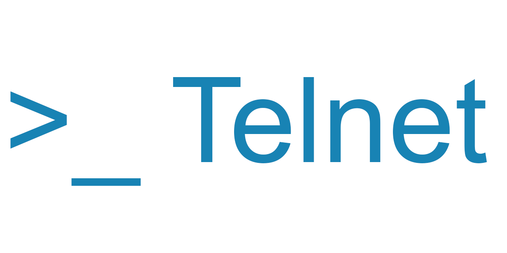

[](https://discord.gg/SK2cWERJF7) [](https://github.com/HarryCordewener/TelnetNegotiationCore/actions/workflows/dotnet.yml) [](https://www.nuget.org/packages/TelnetNegotiationCore)


# Telnet Negotiation Core
## Summary 
This project provides a library that implements telnet functionality, and as many of its RFCs are viable, in a testable manner. 
This is done with an eye on MUDs at this time, but may improve to support more terminal capabilities as time permits and if there is ask for it.

The library now features a modern plugin-based architecture with System.Threading.Channels for high-performance async processing, making it suitable for production use with proper backpressure handling and DOS protection.

All outgoing writes — negotiation responses, `SendAsync`, `SendPromptAsync`, `SendGMCPCommand`, etc. — are serialized internally via a `SemaphoreSlim` write lock. This means callers do **not** need to add their own external locking around concurrent writes on a telnet connection.

## State
This library is in a stable state. The legacy API remains fully supported for backward compatibility, while a new plugin-based architecture is available for modern applications.

## Support
| RFC                                                 | Description                        | Supported  | Comments           |
| --------------------------------------------------- | ---------------------------------- |------------| ------------------ |
| [RFC 855](http://www.faqs.org/rfcs/rfc855.html)     | Telnet Option Specification        | Full       |                    |
| [RFC 1091](http://www.faqs.org/rfcs/rfc1091.html)   | Terminal Type Negotiation          | Full       |                    |
| [MTTS](https://tintin.mudhalla.net/protocols/mtts)  | MTTS Negotiation (Extends TTYPE)   | Full       |                    |
| [RFC 1073](http://www.faqs.org/rfcs/rfc1073.html)   | Window Size Negotiation (NAWS)     | Full       |                    |
| [GMCP](https://tintin.mudhalla.net/protocols/gmcp)  | Generic Mud Communication Protocol | Full       |                    |
| [MSSP](https://tintin.mudhalla.net/protocols/mssp)  | MSSP Negotiation                   | Full       |                    |
| [RFC 885](http://www.faqs.org/rfcs/rfc885.html)     | End Of Record Negotiation          | Full       |                    | 
| [EOR](https://tintin.mudhalla.net/protocols/eor)    | End Of Record Negotiation          | Full       |                    |
| [MSDP](https://tintin.mudhalla.net/protocols/msdp)  | Mud Server Data Protocol           | Full       |                    |
| [RFC 2066](http://www.faqs.org/rfcs/rfc2066.html)   | Charset Negotiation                | Full       |                    |
| [RFC 858](http://www.faqs.org/rfcs/rfc858.html)     | Suppress GOAHEAD Negotiation       | Full       |                    |
| [RFC 1572](http://www.faqs.org/rfcs/rfc1572.html)   | New Environment Negotiation        | Full       |                    |
| [MNES](https://tintin.mudhalla.net/protocols/mnes)  | Mud New Environment Negotiation    | Full       |                    |
| [MCCP](https://tintin.mudhalla.net/protocols/mccp)  | Mud Client Compression Protocol    | Full       | MCCP2 and MCCP3    |
| [RFC 1950](https://tintin.mudhalla.net/rfc/rfc1950) | ZLIB Compression                   | Full       |                    |
| [RFC 857](http://www.faqs.org/rfcs/rfc857.html)     | Echo Negotiation                   | Full       |                    |
| [RFC 1079](http://www.faqs.org/rfcs/rfc1079.html)   | Terminal Speed Negotiation         | Full       |                    |
| [RFC 1372](http://www.faqs.org/rfcs/rfc1372.html)   | Flow Control Negotiation           | Full       |                    |
| [RFC 1184](http://www.faqs.org/rfcs/rfc1184.html)   | Line Mode Negotiation              | Full       | MODE support       |
| [RFC 1096](http://www.faqs.org/rfcs/rfc1096.html)   | X-Display Negotiation              | Full       |                    |
| [RFC 1408](http://www.faqs.org/rfcs/rfc1408.html)   | Environment Negotiation            | Full       |                    | 
| [RFC 2941](http://www.faqs.org/rfcs/rfc2941.html)   | Authentication Negotiation         | Full       |                    |
| [RFC 2946](http://www.faqs.org/rfcs/rfc2946.html)   | Encryption Negotiation             | Full       |                    |

## ANSI Support, ETC?
Being a Telnet Negotiation Library, this library doesn't give support for extensions like ANSI, Pueblo, MXP, etc at this time.

## Use

### Quick Start

`BuildAndStartAsync` wires the connection and starts the read loop automatically. Pass an `IDuplexPipe` (e.g. Kestrel's `connection.Transport`), a `TcpClient`, or a raw `Stream`:

```csharp
var (telnet, readTask) = await new TelnetInterpreterBuilder()
    .UseMode(TelnetInterpreter.TelnetMode.Server)
    .UseLogger(logger)
    .OnSubmit(HandleSubmitAsync)
    .AddPlugin<NAWSProtocol>()
        .OnNAWS(HandleWindowSizeAsync)
    .AddPlugin<GMCPProtocol>()
        .OnGMCPMessage(HandleGMCPAsync)
    .AddPlugin<MSSPProtocol>()
        .OnMSSP(HandleMSSPAsync)
        .WithMSSPConfig(() => new MSSPConfig { Name = "My Server", UTF_8 = true })
    .AddPlugin<CharsetProtocol>()
        .WithCharsetOrder(Encoding.UTF8, Encoding.GetEncoding("iso-8859-1"))
    .AddPlugin<EORProtocol>()
    .AddPlugin<SuppressGoAheadProtocol>()
    .BuildAndStartAsync(connection.Transport);   // IDuplexPipe (Kestrel), TcpClient, or Stream

await readTask; // completes when the connection closes
```

`AddDefaultMUDProtocols()` registers NAWS, GMCP, MSDP, MSSP, Terminal Type, Charset, EOR, and Suppress Go-Ahead in one call:

```csharp
var (telnet, readTask) = await new TelnetInterpreterBuilder()
    .UseMode(TelnetInterpreter.TelnetMode.Server)
    .UseLogger(logger)
    .OnSubmit(HandleSubmitAsync)
    .AddDefaultMUDProtocols(
        onNAWS: HandleWindowSizeAsync,
        onGMCPMessage: HandleGMCPAsync,
        msspConfig: () => new MSSPConfig { Name = "My Server", UTF_8 = true }
    )
    .BuildAndStartAsync(connection.Transport);

await readTask;
```

### Dependency Injection

Register telnet services with `AddTelnetServer()` or `AddTelnetClient()` for seamless integration with `WebApplication.CreateBuilder()` or `Host.CreateApplicationBuilder()`. The factory automatically resolves the logger from the DI container. Configure shared plugins in the registration call:

```csharp
// Program.cs — Server with WebApplication
var builder = WebApplication.CreateBuilder(args);

builder.Services.AddTelnetServer(telnet => telnet
    .AddPlugin<NAWSProtocol>()
    .AddPlugin<GMCPProtocol>()
    .AddPlugin<MSSPProtocol>()
        .WithMSSPConfig(() => new MSSPConfig { Name = "My Server", UTF_8 = true })
    .AddPlugin<TerminalTypeProtocol>()
    .AddPlugin<CharsetProtocol>()
        .WithCharsetOrder(Encoding.UTF8, Encoding.GetEncoding("iso-8859-1"))
    .AddPlugin<EORProtocol>()
    .AddPlugin<SuppressGoAheadProtocol>());

builder.WebHost.UseKestrel(options =>
    options.ListenLocalhost(4202, listenOptions =>
        listenOptions.UseConnectionHandler<MyConnectionHandler>()));

var app = builder.Build();
await app.RunAsync();
```

```csharp
// ConnectionHandler — inject ITelnetInterpreterFactory
public class MyConnectionHandler(
    ILogger<MyConnectionHandler> logger,
    ITelnetInterpreterFactory telnetFactory) : ConnectionHandler
{
    public override async Task OnConnectedAsync(ConnectionContext connection)
    {
        var (telnet, readTask) = await telnetFactory.CreateBuilder()
            .OnSubmit(WriteBackAsync)
            .BuildAndStartAsync(connection.Transport);

        await readTask;
    }
}
```

```csharp
// Program.cs — Client with Host.CreateApplicationBuilder
var builder = Host.CreateApplicationBuilder(args);

builder.Services.AddTelnetClient(telnet => telnet
    .AddDefaultMUDProtocols());
builder.Services.AddTransient<MyTelnetClient>();

var host = builder.Build();
await host.Services.GetRequiredService<MyTelnetClient>().ConnectAsync();
```

### Fluent Configuration Reference

All plugin callbacks and settings are set inline on the builder:

- `.OnNAWS((height, width) => ...)` — window size changes
- `.OnGMCPMessage(msg => ...)` — GMCP messages
- `.OnMSSP(config => ...)` — MSSP requests
- `.OnMSDPMessage((telnet, data) => ...)` — MSDP messages
- `.OnPrompt(() => ...)` — EOR / Suppress Go-Ahead prompt signals
- `.WithMSSPConfig(() => new MSSPConfig { ... })` — server advertisement data
- `.WithCharsetOrder(Encoding.UTF8, ...)` — encoding preference order
- `.WithTTableSupport(true)` / `.OnTTableReceived(...)` / `.OnTTableRequested(...)` — TTABLE support (RFC 2066)

### Manual Connection Management

If you need control over the read loop, use `UsePipe` or `UseStream` to wire only the write side:

```csharp
var telnet = await new TelnetInterpreterBuilder()
    .UseMode(TelnetInterpreter.TelnetMode.Server)
    .UseLogger(logger)
    .OnSubmit(HandleSubmitAsync)
    .UsePipe(connection.Transport)   // wires OnNegotiation → pipe.Output
    .AddPlugin<NAWSProtocol>()
    .BuildAsync();

await TelnetInterpreterBuilder.ReadFromPipeAsync(telnet, connection.Transport.Input, cancellationToken);
```

Or supply `OnNegotiation` and manage the loop entirely:

```csharp
var telnet = await new TelnetInterpreterBuilder()
    .UseMode(TelnetInterpreter.TelnetMode.Server)
    .UseLogger(logger)
    .OnSubmit(HandleSubmitAsync)
    .OnNegotiation(data => WriteToNetworkAsync(data))
    .AddPlugin<NAWSProtocol>()
    .BuildAsync();

while (true)
{
    var result = await connection.Transport.Input.ReadAsync();
    foreach (var segment in result.Buffer)
        await telnet.InterpretByteArrayAsync(segment);
    if (result.IsCompleted) break;
    connection.Transport.Input.AdvanceTo(result.Buffer.End);
}
```

### Client
A documented example exists in the [TestClient Project](TelnetNegotiationCore.TestClient/MockPipelineClient.cs).

```csharp
var (telnet, readTask) = await new TelnetInterpreterBuilder()
    .UseMode(TelnetInterpreter.TelnetMode.Client)
    .UseLogger(logger)
    .OnSubmit(WriteBackAsync)
    .AddPlugin<NAWSProtocol>()
    .AddPlugin<GMCPProtocol>()
        .OnGMCPMessage(SignalGMCPAsync)
    .AddPlugin<MSSPProtocol>()
        .OnMSSP(SignalMSSPAsync)
    .AddPlugin<TerminalTypeProtocol>()
    .AddPlugin<CharsetProtocol>()
        .WithCharsetOrder(Encoding.UTF8, Encoding.GetEncoding("iso-8859-1"))
    .AddPlugin<EORProtocol>()
        .OnPrompt(SignalPromptAsync)
    .AddPlugin<SuppressGoAheadProtocol>()
    .BuildAndStartAsync(tcpClient);

// readTask completes when the server closes the connection
await readTask;
```

### Sending GMCP Messages
Both clients and servers can send GMCP messages using the `SendGMCPCommand` method. The method takes a package name and JSON data.

```csharp
// Send a simple GMCP message
await telnet.SendGMCPCommand("Core.Hello", "{\"client\":\"MyClient\",\"version\":\"1.0\"}");

// Send character vitals
await telnet.SendGMCPCommand("Char.Vitals", "{\"hp\":1000,\"maxhp\":1500,\"mp\":500,\"maxmp\":800}");

// Send room information
await telnet.SendGMCPCommand("Room.Info", "{\"num\":12345,\"name\":\"A dark room\",\"area\":\"The Dungeon\"}");

// The telnet interpreter will automatically handle GMCP negotiation
// Messages will only be sent if the remote party supports GMCP
```

To receive GMCP messages, use the `OnGMCPMessage` callback as shown in the initialization example above.

### Using ENVIRON Protocol
The ENVIRON protocol (RFC 1408) is the original environment variable negotiation protocol. It's simpler than NEW-ENVIRON and supports only basic environment variables (no user variables). This protocol can be activated in isolation.

#### Server Side
```csharp
var telnet = await new TelnetInterpreterBuilder()
    .UseMode(TelnetInterpreter.TelnetMode.Server)
    .UseLogger(logger)
    .OnSubmit((data, encoding, telnet) => HandleSubmitAsync(data, encoding, telnet))
    .OnNegotiation((data) => WriteToNetworkAsync(data))
    .AddPlugin<EnvironProtocol>()
        .OnEnvironmentVariables((envVars) => 
        {
            // envVars contains standard environment variables (USER, LANG, etc.)
            logger.LogInformation("Received {EnvCount} environment variables", envVars.Count);
            foreach (var (key, value) in envVars)
            {
                logger.LogInformation("  {Key} = {Value}", key, value);
            }
            return ValueTask.CompletedTask;
        })
    .BuildAsync();
```

#### Client Side
The client automatically responds to server requests for environment variables. You can customize which variables to send:

```csharp
// Option 1: Use defaults (USER and LANG from system)
var telnet = await new TelnetInterpreterBuilder()
    .UseMode(TelnetInterpreter.TelnetMode.Client)
    .UseLogger(logger)
    .OnSubmit((data, encoding, telnet) => HandleSubmitAsync(data, encoding, telnet))
    .OnNegotiation((data) => WriteToNetworkAsync(data))
    .AddPlugin<EnvironProtocol>()
    .BuildAsync();

// Option 2: Configure custom environment variables
var telnet = await new TelnetInterpreterBuilder()
    .UseMode(TelnetInterpreter.TelnetMode.Client)
    .UseLogger(logger)
    .OnSubmit((data, encoding, telnet) => HandleSubmitAsync(data, encoding, telnet))
    .OnNegotiation((data) => WriteToNetworkAsync(data))
    .AddPlugin<EnvironProtocol>()
        .WithClientEnvironmentVariables(new Dictionary<string, string>
        {
            { "USER", "myusername" },
            { "LANG", "en_US.UTF-8" },
            { "TERM", "xterm-256color" }
        })
    .BuildAsync();
```

**Note:** If you need user-defined variables or more advanced features, use `NewEnvironProtocol` (RFC 1572) instead. Both protocols can coexist if needed.

### Using TTABLE (Translation Tables) with Charset Protocol
The TTABLE feature of RFC 2066 Charset protocol allows negotiation of custom character set translation tables. This is useful for specialized character mappings, legacy systems, or private character sets not registered with IANA.

#### Server Side
```csharp
var telnet = await new TelnetInterpreterBuilder()
    .UseMode(TelnetInterpreter.TelnetMode.Server)
    .UseLogger(logger)
    .OnSubmit((data, encoding, telnet) => HandleSubmitAsync(data, encoding, telnet))
    .OnNegotiation((data) => WriteToNetworkAsync(data))
    .AddPlugin<CharsetProtocol>()
        .WithCharsetOrder(Encoding.UTF8, Encoding.GetEncoding("iso-8859-1"))
        .WithTTableSupport(true)
        .OnTTableReceived(async (ttableData) => 
        {
            // Parse and validate the TTABLE data
            // Version 1 format: <version> <sep> <charset1> <sep> <size1> <count1> <charset2> <sep> <size2> <count2> <map1> <map2>
            logger.LogInformation("Received TTABLE with {Bytes} bytes", ttableData.Length);
            
            // Validate the table structure
            if (ttableData.Length < 2 || ttableData[0] != 1)
            {
                logger.LogWarning("Invalid TTABLE version or format");
                return false; // NAK - request retransmission
            }
            
            // Store or apply the translation table
            await StoreTranslationTable(ttableData);
            return true; // ACK - accept the table
        })
    .BuildAsync();
```

The server automatically announces charset support and can receive TTABLE data when the client sends a translation table.

#### Client Side
```csharp
var telnet = await new TelnetInterpreterBuilder()
    .UseMode(TelnetInterpreter.TelnetMode.Client)
    .UseLogger(logger)
    .OnSubmit((data, encoding, telnet) => HandleSubmitAsync(data, encoding, telnet))
    .OnNegotiation((data) => WriteToNetworkAsync(data))
    .AddPlugin<CharsetProtocol>()
        .WithTTableSupport(true)
        .OnTTableRequested(async () => 
        {
            // Generate custom translation table
            // Return null to reject the request
            return BuildCustomTTable("custom-charset", "utf-8");
        })
    .BuildAsync();
```

#### Programmatic TTABLE API
You can also send TTABLE messages programmatically:

```csharp
// Get the charset plugin
var charsetPlugin = telnet.PluginManager!.GetPlugin<CharsetProtocol>();

// Send a TTABLE-IS message
var ttableData = BuildTTableVersion1("my-charset", "utf-8", translationMap);
await charsetPlugin!.SendTTableAsync(ttableData);

// Reject a TTABLE request
await charsetPlugin!.SendTTableRejectedAsync();
```

#### TTABLE Version 1 Format
The TTABLE version 1 format is defined in RFC 2066:
- **Version byte**: Always 1 for version 1
- **Separator**: Single byte separator character (e.g., ';' or ' ')
- **Charset 1 name**: ASCII string terminated by separator
- **Size 1**: 1 byte indicating bits per character (typically 8)
- **Count 1**: 3 bytes (network byte order) indicating number of characters in map
- **Charset 2 name**: ASCII string terminated by separator
- **Size 2**: 1 byte indicating bits per character
- **Count 2**: 3 bytes (network byte order) indicating number of characters in map
- **Map 1**: Translation from charset 1 to charset 2
- **Map 2**: Translation from charset 2 to charset 1

**Note:** TTABLE is an advanced feature. Most applications should use standard named character sets via the regular charset negotiation. TTABLE is primarily useful for legacy systems or specialized character mappings not available as standard encodings.

### Using NEW-ENVIRON Protocol
The NEW-ENVIRON protocol (RFC 1572) allows exchange of environment variables between client and server. MNES (Mud New Environment Standard) extends this with the MTTS flag 512.

#### Server Side
```csharp
var telnet = await new TelnetInterpreterBuilder()
    .UseMode(TelnetInterpreter.TelnetMode.Server)
    .UseLogger(logger)
    .OnSubmit((data, encoding, telnet) => HandleSubmitAsync(data, encoding, telnet))
    .OnNegotiation((data) => WriteToNetworkAsync(data))
    .AddPlugin<NewEnvironProtocol>()
        .OnEnvironmentVariables((envVars, userVars) => 
        {
            // envVars contains standard environment variables (USER, LANG, etc.)
            // userVars contains user-defined variables
            logger.LogInformation("Received {EnvCount} environment variables", envVars.Count);
            foreach (var (key, value) in envVars)
            {
                logger.LogInformation("  {Key} = {Value}", key, value);
            }
            return ValueTask.CompletedTask;
        })
    .BuildAsync();
```

#### Client Side
The client automatically responds to server requests for environment variables. Common variables like USER and LANG are sent automatically.

```csharp
var telnet = await new TelnetInterpreterBuilder()
    .UseMode(TelnetInterpreter.TelnetMode.Client)
    .UseLogger(logger)
    .OnSubmit((data, encoding, telnet) => HandleSubmitAsync(data, encoding, telnet))
    .OnNegotiation((data) => WriteToNetworkAsync(data))
    .AddPlugin<NewEnvironProtocol>()
    .BuildAsync();

// Environment variables are automatically sent when the server requests them
```

#### MNES Support
MNES (Mud New Environment Standard) support is automatically indicated via the MTTS flag 512 when both Terminal Type and NEW-ENVIRON protocols are enabled. No additional configuration is needed.

### Using MCCP Protocol
The MCCP (Mud Client Compression Protocol) provides bandwidth reduction through zlib compression. MCCP2 compresses server-to-client data, while MCCP3 compresses client-to-server data.

#### Server Side
```csharp
var telnet = await new TelnetInterpreterBuilder()
    .UseMode(TelnetInterpreter.TelnetMode.Server)
    .UseLogger(logger)
    .OnSubmit((data, encoding, telnet) => HandleSubmitAsync(data, encoding, telnet))
    .OnNegotiation((data) => WriteToNetworkAsync(data))
    .AddPlugin<MCCPProtocol>()
        .OnCompressionEnabled((version, enabled) => 
        {
            logger.LogInformation("MCCP{Version} compression {State}", 
                version, enabled ? "enabled" : "disabled");
            return ValueTask.CompletedTask;
        })
    .BuildAsync();
```

The server automatically announces MCCP2 and MCCP3 support. When the client accepts, compression is enabled transparently.

#### Client Side
The client automatically responds to server MCCP offers. MCCP2 decompresses server data, and MCCP3 compresses client data when supported.

```csharp
var telnet = await new TelnetInterpreterBuilder()
    .UseMode(TelnetInterpreter.TelnetMode.Client)
    .UseLogger(logger)
    .OnSubmit((data, encoding, telnet) => HandleSubmitAsync(data, encoding, telnet))
    .OnNegotiation((data) => WriteToNetworkAsync(data))
    .AddPlugin<MCCPProtocol>()
        .OnCompressionEnabled((version, enabled) => 
        {
            logger.LogInformation("MCCP{Version} compression {State}", 
                version, enabled ? "enabled" : "disabled");
            return ValueTask.CompletedTask;
        })
    .BuildAsync();

// Compression is handled automatically - no manual intervention needed
```

#### Benefits
- **MCCP2**: Reduces server-to-client bandwidth by 75-90%
- **MCCP3**: Reduces client-to-server bandwidth and provides security through obscurity
- **Automatic**: Compression/decompression is transparent once negotiated
- **Standards-compliant**: Uses zlib (RFC 1950) compression via System.IO.Compression

### Using Terminal Speed Protocol
The Terminal Speed protocol (RFC 1079) allows clients and servers to exchange terminal speed information (transmit and receive speeds in bits per second).

#### Server Side
```csharp
var telnet = await new TelnetInterpreterBuilder()
    .UseMode(TelnetInterpreter.TelnetMode.Server)
    .UseLogger(logger)
    .OnSubmit((data, encoding, telnet) => HandleSubmitAsync(data, encoding, telnet))
    .OnNegotiation((data) => WriteToNetworkAsync(data))
    .AddPlugin<TerminalSpeedProtocol>()
        .OnTerminalSpeed((transmitSpeed, receiveSpeed) => 
        {
            logger.LogInformation("Client terminal speed: {Transmit} bps transmit, {Receive} bps receive",
                transmitSpeed, receiveSpeed);
            return ValueTask.CompletedTask;
        })
    .BuildAsync();
```

The server automatically announces support and requests terminal speed from clients that support it.

#### Client Side
The client automatically responds to server requests for terminal speed. You can customize the speeds to send:

```csharp
// Option 1: Use defaults (38400 bps transmit and receive)
var telnet = await new TelnetInterpreterBuilder()
    .UseMode(TelnetInterpreter.TelnetMode.Client)
    .UseLogger(logger)
    .OnSubmit((data, encoding, telnet) => HandleSubmitAsync(data, encoding, telnet))
    .OnNegotiation((data) => WriteToNetworkAsync(data))
    .AddPlugin<TerminalSpeedProtocol>()
    .BuildAsync();

// Option 2: Configure custom terminal speeds
var telnet = await new TelnetInterpreterBuilder()
    .UseMode(TelnetInterpreter.TelnetMode.Client)
    .UseLogger(logger)
    .OnSubmit((data, encoding, telnet) => HandleSubmitAsync(data, encoding, telnet))
    .OnNegotiation((data) => WriteToNetworkAsync(data))
    .AddPlugin<TerminalSpeedProtocol>()
        .WithClientTerminalSpeed(115200, 115200)  // transmit speed, receive speed in bps
    .BuildAsync();
```

#### Use Cases
- **Server optimization**: Adjust output based on connection speed
- **Client diagnostics**: Report actual connection speed to server
- **Compatibility**: Support legacy systems that rely on terminal speed information

**Note:** Most modern applications don't need terminal speed information as network speeds far exceed terminal speeds. This protocol is primarily useful for compatibility with legacy systems or specialized use cases.

### Using X-Display Location Protocol
The X-Display Location protocol (RFC 1096) allows clients and servers to exchange X Window System display location information. This is useful for X11 applications that need to know where to display their GUI.

#### Server Side
```csharp
var telnet = await new TelnetInterpreterBuilder()
    .UseMode(TelnetInterpreter.TelnetMode.Server)
    .UseLogger(logger)
    .OnSubmit((data, encoding, telnet) => HandleSubmitAsync(data, encoding, telnet))
    .OnNegotiation((data) => WriteToNetworkAsync(data))
    .AddPlugin<XDisplayProtocol>()
        .OnDisplayLocation((displayLocation) => 
        {
            logger.LogInformation("Client X display location: {DisplayLocation}", displayLocation);
            return ValueTask.CompletedTask;
        })
    .BuildAsync();
```

The server automatically announces support and requests the X display location from clients that support it.

#### Client Side
The client automatically responds to server requests for X display location. You can customize the display location to send:

```csharp
// Option 1: Use default (empty display location)
var telnet = await new TelnetInterpreterBuilder()
    .UseMode(TelnetInterpreter.TelnetMode.Client)
    .UseLogger(logger)
    .OnSubmit((data, encoding, telnet) => HandleSubmitAsync(data, encoding, telnet))
    .OnNegotiation((data) => WriteToNetworkAsync(data))
    .AddPlugin<XDisplayProtocol>()
    .BuildAsync();

// Option 2: Configure custom X display location
var telnet = await new TelnetInterpreterBuilder()
    .UseMode(TelnetInterpreter.TelnetMode.Client)
    .UseLogger(logger)
    .OnSubmit((data, encoding, telnet) => HandleSubmitAsync(data, encoding, telnet))
    .OnNegotiation((data) => WriteToNetworkAsync(data))
    .AddPlugin<XDisplayProtocol>()
        .WithClientDisplayLocation("localhost:0.0")  // Standard X display format
    .BuildAsync();
```

#### Display Location Format
The X display location typically follows the format: `hostname:displaynumber.screennumber`

Examples:
- `localhost:0.0` - Local X server, display 0, screen 0
- `192.168.1.100:0` - Remote X server at specific IP
- `myhost.example.com:10.0` - Remote X server via hostname

#### Use Cases
- **X11 Forwarding**: Enable X Window System applications to display on client's screen
- **Remote Desktop**: Support applications that need to know the display location
- **Legacy Unix Systems**: Compatibility with older Unix/Linux systems using X11

**Note:** This protocol is primarily useful for X Window System applications. Modern applications often use different display protocols (like VNC, RDP, or web-based interfaces).

### Using Flow Control Protocol
The Flow Control protocol (RFC 1372) allows servers to remotely control software flow control settings (XON/XOFF) on the client. This is useful for controlling when clients can send data and configuring restart behavior.

#### Server Side
```csharp
var telnet = await new TelnetInterpreterBuilder()
    .UseMode(TelnetInterpreter.TelnetMode.Server)
    .UseLogger(logger)
    .OnSubmit((data, encoding, telnet) => HandleSubmitAsync(data, encoding, telnet))
    .OnNegotiation((data) => WriteToNetworkAsync(data))
    .AddPlugin<FlowControlProtocol>()
    .BuildAsync();

// Get the plugin to send commands
var flowControl = telnet.PluginManager!.GetPlugin<FlowControlProtocol>();

// Enable flow control on the client
await flowControl!.EnableFlowControlAsync();

// Set restart mode to allow any character to restart output
await flowControl.SetRestartAnyAsync();

// Or set restart mode to allow only XON to restart output
await flowControl.SetRestartXONAsync();

// Disable flow control
await flowControl.DisableFlowControlAsync();
```

The server automatically announces support and can control the client's flow control settings.

#### Client Side
The client automatically responds to server flow control commands. You can monitor state changes:

```csharp
var telnet = await new TelnetInterpreterBuilder()
    .UseMode(TelnetInterpreter.TelnetMode.Client)
    .UseLogger(logger)
    .OnSubmit((data, encoding, telnet) => HandleSubmitAsync(data, encoding, telnet))
    .OnNegotiation((data) => WriteToNetworkAsync(data))
    .AddPlugin<FlowControlProtocol>()
        .OnFlowControlStateChanged((enabled) => 
        {
            logger.LogInformation("Flow control {State}", enabled ? "enabled" : "disabled");
            return ValueTask.CompletedTask;
        })
        .OnRestartModeChanged((mode) =>
        {
            logger.LogInformation("Restart mode changed to {Mode}", mode);
            return ValueTask.CompletedTask;
        })
    .BuildAsync();

// Check current state
var flowControl = telnet.PluginManager!.GetPlugin<FlowControlProtocol>();
var isEnabled = flowControl!.IsFlowControlEnabled;
var restartMode = flowControl.RestartMode;
```

#### Flow Control Details
- **OFF (0)**: Disables flow control - XOFF/XON characters are passed through as normal input
- **ON (1)**: Enables flow control - XOFF stops output, XON resumes it
- **RESTART-ANY (2)**: Any character (except XOFF) can restart output after XOFF
- **RESTART-XON (3)**: Only XON character can restart output after XOFF

**Note:** Per RFC 1372, flow control is automatically enabled when the client accepts the protocol. The server can then send commands to toggle it or configure restart behavior.

### Using Line Mode Protocol
The Line Mode protocol (RFC 1184) allows negotiation of whether line editing should be done locally on the client or remotely on the server. This is useful for controlling how user input is processed.

#### Server Side
```csharp
var telnet = await new TelnetInterpreterBuilder()
    .UseMode(TelnetInterpreter.TelnetMode.Server)
    .UseLogger(logger)
    .OnSubmit((data, encoding, telnet) => HandleSubmitAsync(data, encoding, telnet))
    .OnNegotiation((data) => WriteToNetworkAsync(data))
    .AddPlugin<LineModeProtocol>()
        .OnModeChanged((mode) => 
        {
            logger.LogInformation("Line mode changed to: {Mode:X2}", mode);
            return ValueTask.CompletedTask;
        })
    .BuildAsync();

// Get the plugin to send mode commands
var lineMode = telnet.PluginManager!.GetPlugin<LineModeProtocol>();

// Enable EDIT mode (client does local line editing)
await lineMode!.EnableEditModeAsync();

// Enable TRAPSIG mode (client traps signals like Ctrl-C)
await lineMode.EnableTrapSigModeAsync();

// Or set both at once with a custom mode byte
await lineMode.SetModeAsync(0x03); // EDIT | TRAPSIG

// Disable modes
await lineMode.DisableEditModeAsync();
await lineMode.DisableTrapSigModeAsync();
```

The server automatically announces support and can control the client's line mode settings.

#### Client Side
The client automatically responds to server line mode commands. You can monitor mode changes:

```csharp
var telnet = await new TelnetInterpreterBuilder()
    .UseMode(TelnetInterpreter.TelnetMode.Client)
    .UseLogger(logger)
    .OnSubmit((data, encoding, telnet) => HandleSubmitAsync(data, encoding, telnet))
    .OnNegotiation((data) => WriteToNetworkAsync(data))
    .AddPlugin<LineModeProtocol>()
        .OnModeChanged((mode) =>
        {
            logger.LogInformation("Server set line mode to: {Mode:X2}", mode);
            return ValueTask.CompletedTask;
        })
    .BuildAsync();

// Check current state
var lineMode = telnet.PluginManager!.GetPlugin<LineModeProtocol>();
var isEditMode = lineMode!.IsEditModeEnabled;
var isTrapSig = lineMode.IsTrapSigModeEnabled;
```

#### Line Mode Details
- **EDIT (0x01)**: When set, client performs local line editing; when unset, server handles all editing
- **TRAPSIG (0x02)**: When set, client traps interrupt/quit signals; when unset, signals are passed through
- **MODE_ACK (0x04)**: Acknowledgment bit used in mode negotiations
- **SOFT_TAB (0x08)**: Advises client on tab handling (expand to spaces vs. send as tab)
- **LIT_ECHO (0x10)**: Advises client to echo non-printable characters literally

**Note:** SLC (Set Local Characters) and FORWARDMASK subnegotiations are not currently implemented. The protocol focuses on MODE negotiations, which are the most commonly used feature.

### Using Authentication Protocol
The Authentication protocol (RFC 2941) provides a framework for negotiating authentication between client and server. This implementation supports extensible authentication through callbacks, allowing consumers to implement any authentication mechanism.

#### Default Behavior (No Authentication)
By default, the protocol rejects all authentication types with NULL response, allowing sessions to proceed without authentication:

```csharp
var telnet = await new TelnetInterpreterBuilder()
    .UseMode(TelnetInterpreter.TelnetMode.Server)
    .UseLogger(logger)
    .OnSubmit((data, encoding, telnet) => HandleSubmitAsync(data, encoding, telnet))
    .OnNegotiation((data) => WriteToNetworkAsync(data))
    .AddPlugin<AuthenticationProtocol>()
    .BuildAsync();

// Protocol auto-negotiates and rejects authentication with NULL
// Session continues without authentication
```

#### Server Side with Custom Authentication
Servers can provide custom authentication by specifying supported authentication types and handling client responses:

```csharp
var telnet = await new TelnetInterpreterBuilder()
    .UseMode(TelnetInterpreter.TelnetMode.Server)
    .UseLogger(logger)
    .OnSubmit((data, encoding, telnet) => HandleSubmitAsync(data, encoding, telnet))
    .OnNegotiation((data) => WriteToNetworkAsync(data))
    .AddPlugin<AuthenticationProtocol>()
        // Declare which authentication types to offer
        .WithAuthenticationTypes(async () => new List<(byte AuthType, byte Modifiers)>
        {
            (5, 0),  // SRP with no modifiers
            (6, 2)   // RSA with AUTH_HOW_MUTUAL (0x02)
        })
        // Handle client authentication responses
        .OnAuthenticationResponse(async (authData) =>
        {
            var authType = authData[0];
            var modifiers = authData[1];
            var credentials = authData.Skip(2).ToArray();
            
            logger.LogInformation("Received authentication type {Type} with {Bytes} bytes of credentials", 
                authType, credentials.Length);
            
            // Validate credentials and send REPLY if needed
            var isValid = await ValidateCredentials(authType, credentials);
            
            if (!isValid)
            {
                // Get the plugin to send rejection or challenge
                var authPlugin = telnet.PluginManager!.GetPlugin<AuthenticationProtocol>();
                await authPlugin!.SendAuthenticationReplyAsync(new byte[] { authType, modifiers, 0xFF }); // Reject
            }
        })
    .BuildAsync();
```

#### Client Side with Custom Authentication
Clients can handle authentication requests from servers:

```csharp
var telnet = await new TelnetInterpreterBuilder()
    .UseMode(TelnetInterpreter.TelnetMode.Client)
    .UseLogger(logger)
    .OnSubmit((data, encoding, telnet) => HandleSubmitAsync(data, encoding, telnet))
    .OnNegotiation((data) => WriteToNetworkAsync(data))
    .AddPlugin<AuthenticationProtocol>()
        // Handle server authentication requests
        .OnAuthenticationRequest(async (authTypePairs) =>
        {
            // authTypePairs contains pairs of (authType, modifiers) offered by server
            logger.LogInformation("Server offers {Count} authentication types", authTypePairs.Length / 2);
            
            // Choose first supported type and provide credentials
            if (authTypePairs.Length >= 2)
            {
                var authType = authTypePairs[0];
                var modifiers = authTypePairs[1];
                var credentials = await GetCredentials(authType);
                
                // Return auth response: [authType, modifiers, ...credentials]
                var response = new List<byte> { authType, modifiers };
                response.AddRange(credentials);
                return response.ToArray();
            }
            
            // Return null to reject with NULL type
            return null;
        })
    .BuildAsync();
```

#### Programmatic API
The protocol also provides methods to send authentication messages programmatically:

```csharp
// Get the authentication plugin
var authPlugin = telnet.PluginManager!.GetPlugin<AuthenticationProtocol>();

// Server: Send authentication request with specific types
await authPlugin!.SendAuthenticationRequestAsync(new List<(byte, byte)>
{
    (5, 0),  // SRP
    (6, 2)   // RSA with mutual auth
});

// Client: Send authentication response
await authPlugin!.SendAuthenticationResponseAsync(new byte[] 
{ 
    5, 0,           // SRP, no modifiers
    0x01, 0x02, 0x03 // Credential data
});

// Server: Send authentication reply (accept/reject/challenge)
await authPlugin!.SendAuthenticationReplyAsync(new byte[]
{
    5, 0,           // SRP, no modifiers  
    0x00            // Accept status
});
```

#### Authentication Types and Modifiers
Common authentication types defined in RFC 2941:
- **0**: NULL (no authentication)
- **1**: KERBEROS_V4
- **2**: KERBEROS_V5
- **5**: SRP (Secure Remote Password)
- **6**: RSA
- **7**: SSL

Common modifiers (combine with bitwise OR):
- **AUTH_WHO_MASK (0x01)**: Direction
  - 0x00: CLIENT_TO_SERVER
  - 0x01: SERVER_TO_CLIENT
- **AUTH_HOW_MASK (0x02)**: Method
  - 0x00: ONE_WAY
  - 0x02: MUTUAL
- **ENCRYPT_MASK (0x14)**: Encryption
  - 0x00: ENCRYPT_OFF
  - 0x04: ENCRYPT_USING_TELOPT
  - 0x10: ENCRYPT_AFTER_EXCHANGE
- **INI_CRED_FWD_MASK (0x08)**: Credential forwarding
  - 0x00: OFF
  - 0x08: ON

#### Use Cases
- **Custom authentication**: Implement Kerberos, SRP, RSA, or any RFC 2941-compliant mechanism
- **Pass/fail control**: Full control over credential validation and authentication status
- **Multi-round authentication**: Support challenge-response protocols using REPLY messages
- **Backward compatibility**: Defaults to NULL rejection when callbacks not configured

**Note:** This protocol provides the negotiation framework. Actual cryptographic authentication mechanisms must be implemented in the callbacks using appropriate security libraries.

### Using Encryption Protocol
The Encryption protocol (RFC 2946) provides a framework for negotiating telnet data stream encryption between client and server. This implementation supports extensible encryption through callbacks, allowing consumers to implement any encryption algorithm.

#### Default Behavior (No Encryption)
By default, the protocol rejects all encryption types with NULL response, allowing sessions to proceed without encryption:

```csharp
var telnet = await new TelnetInterpreterBuilder()
    .UseMode(TelnetInterpreter.TelnetMode.Server)
    .UseLogger(logger)
    .OnSubmit((data, encoding, telnet) => HandleSubmitAsync(data, encoding, telnet))
    .OnNegotiation((data) => WriteToNetworkAsync(data))
    .AddPlugin<EncryptionProtocol>()
    .BuildAsync();

// Protocol auto-negotiates and rejects encryption with NULL
// Session continues without encryption
```

#### Server Side with Custom Encryption
Servers can provide custom encryption by specifying supported encryption types and handling client initialization:

```csharp
var telnet = await new TelnetInterpreterBuilder()
    .UseMode(TelnetInterpreter.TelnetMode.Server)
    .UseLogger(logger)
    .OnSubmit((data, encoding, telnet) => HandleSubmitAsync(data, encoding, telnet))
    .OnNegotiation((data) => WriteToNetworkAsync(data))
    .AddPlugin<EncryptionProtocol>()
        // Declare which encryption types to offer
        .WithEncryptionTypes(async () => new List<byte>
        {
            1,  // DES_CFB64
            3   // DES3_CFB64
        })
        // Handle client encryption initialization
        .OnEncryptionRequest(async (encData) =>
        {
            var encType = encData[0];
            var initData = encData.Skip(1).ToArray();
            
            logger.LogInformation("Received encryption type {Type} with {Bytes} bytes of init data", 
                encType, initData.Length);
            
            // Initialize decryption and send REPLY if needed
            await InitializeDecryption(encType, initData);
        })
        .OnEncryptionStart(async (keyId) =>
        {
            logger.LogInformation("Encryption started with keyId {KeyId}", BitConverter.ToString(keyId));
            await ActivateDecryption();
        })
        .OnEncryptionEnd(async () =>
        {
            logger.LogInformation("Encryption ended");
            await DeactivateDecryption();
        })
    .BuildAsync();
```

#### Client Side with Custom Encryption
Clients can handle encryption requests from servers:

```csharp
var telnet = await new TelnetInterpreterBuilder()
    .UseMode(TelnetInterpreter.TelnetMode.Client)
    .UseLogger(logger)
    .OnSubmit((data, encoding, telnet) => HandleSubmitAsync(data, encoding, telnet))
    .OnNegotiation((data) => WriteToNetworkAsync(data))
    .AddPlugin<EncryptionProtocol>()
        // Handle server encryption support
        .OnEncryptionSupport(async (supportedTypes) =>
        {
            // supportedTypes contains list of encryption types offered by server
            logger.LogInformation("Server offers {Count} encryption types", supportedTypes.Length);
            
            // Choose first supported type and provide initialization data
            if (supportedTypes.Length > 0 && supportedTypes.Contains((byte)1)) // DES_CFB64
            {
                var encType = (byte)1;
                var initData = await GenerateEncryptionInitData(encType);
                
                // Return encryption initialization: [encType, ...init data]
                var response = new List<byte> { encType };
                response.AddRange(initData);
                return response.ToArray();
            }
            
            // Return null to reject with NULL type
            return null;
        })
        .OnEncryptionStart(async (keyId) =>
        {
            logger.LogInformation("Encryption started with keyId {KeyId}", BitConverter.ToString(keyId));
            await ActivateEncryption();
        })
        .OnEncryptionEnd(async () =>
        {
            logger.LogInformation("Encryption ended");
            await DeactivateEncryption();
        })
    .BuildAsync();
```

#### Programmatic API
The protocol also provides methods to send encryption messages programmatically:

```csharp
// Get the encryption plugin
var encPlugin = telnet.PluginManager!.GetPlugin<EncryptionProtocol>();

// Server: Send encryption support message with specific types
await encPlugin!.SendEncryptionSupportAsync(new List<byte>
{
    1,  // DES_CFB64
    3   // DES3_CFB64
});

// Client: Send encryption IS message to initialize
await encPlugin!.SendEncryptionIsAsync(new byte[] 
{ 
    1,              // DES_CFB64
    0x01, 0x02      // Init data
});

// Server: Send encryption REPLY message
await encPlugin!.SendEncryptionReplyAsync(new byte[]
{
    1,              // DES_CFB64  
    0x03, 0x04      // Reply data
});

// Either side (WILL side): Start encryption
await encPlugin!.SendEncryptionStartAsync(new byte[] { 0 }); // Default keyid

// Either side (WILL side): End encryption
await encPlugin!.SendEncryptionEndAsync();

// Either side (DO side): Request encryption start
await encPlugin!.SendEncryptionRequestStartAsync(new byte[] { 0 }); // Optional keyid

// Either side (DO side): Request encryption end
await encPlugin!.SendEncryptionRequestEndAsync();
```

#### Encryption Types
Common encryption types defined in RFC 2946:
- **0**: NULL (no encryption)
- **1**: DES_CFB64
- **2**: DES_OFB64
- **3**: DES3_CFB64
- **4**: DES3_OFB64
- **8**: CAST5_40_CFB64
- **9**: CAST5_40_OFB64
- **10**: CAST128_CFB64
- **11**: CAST128_OFB64

#### Encryption Commands
- **IS (0)**: Sent by WILL side to initialize encryption type
- **SUPPORT (1)**: Sent by DO side with list of supported types
- **REPLY (2)**: Sent by DO side to continue initialization exchange
- **START (3)**: Sent by WILL side to begin encrypting data
- **END (4)**: Sent by WILL side to stop encrypting data
- **REQUEST-START (5)**: Sent by DO side to request encryption
- **REQUEST-END (6)**: Sent by DO side to request stopping encryption
- **ENC_KEYID (7)**: Verify encryption key identifier
- **DEC_KEYID (8)**: Verify decryption key identifier

#### Use Cases
- **Data confidentiality**: Protect telnet data stream from eavesdropping
- **Custom encryption**: Implement DES, 3DES, CAST, or any RFC 2946-compliant algorithm
- **Key management**: Support multiple encryption keys via key identifiers
- **Dynamic control**: Start/stop encryption on demand during session
- **Backward compatibility**: Defaults to NULL rejection when callbacks not configured

#### Security Considerations
Per RFC 2946, the ENCRYPT option used in isolation provides protection against passive attacks but not against active attacks. It should be used alongside the Authentication option (with ENCRYPT_USING_TELOPT modifier) to provide protection against active attacks that attempt to prevent encryption negotiation.

**Note:** This protocol provides the negotiation framework. Actual cryptographic encryption algorithms must be implemented in the callbacks using appropriate security libraries. Consider using modern alternatives like TLS for new implementations.

Start interpreting.
```csharp
while (true)
{
  var result = await input.ReadAsync();
  var buffer = result.Buffer;
  
  foreach (var segment in buffer)
  {
    await telnet.InterpretByteArrayAsync(segment);
  }
  
  if (result.IsCompleted)
    break;
    
  input.AdvanceTo(buffer.End);
}
```

### Server
A documented example exists in the [TestServer Project](TelnetNegotiationCore.TestServer/KestrelMockServer.cs).
This uses a Kestrel server to make the TCP handling easier.

> **Thread safety**: All outgoing writes are serialized internally. You do **not** need external locking around concurrent writes on a telnet connection.

```csharp
public override async Task OnConnectedAsync(ConnectionContext connection)
{
    _logger.LogInformation("{ConnectionId} connected", connection.ConnectionId);

    var msdpHandler = new MSDPServerHandler(new MSDPServerModel(MSDPUpdateBehavior)
    {
        Commands = () => ["help", "stats", "info"],
        Configurable_Variables = () => ["CLIENT_NAME", "CLIENT_VERSION", "PLUGIN_ID"],
        Reportable_Variables = () => ["ROOM"],
        Sendable_Variables = () => ["ROOM"],
    });

    var (telnet, readTask) = await new TelnetInterpreterBuilder()
        .UseMode(TelnetInterpreter.TelnetMode.Server)
        .UseLogger(_logger)
        .OnSubmit(WriteBackAsync)
        .AddPlugin<NAWSProtocol>()
            .OnNAWS(SignalNAWSAsync)
        .AddPlugin<GMCPProtocol>()
            .OnGMCPMessage(SignalGMCPAsync)
        .AddPlugin<MSDPProtocol>()
            .OnMSDPMessage((t, config) => SignalMSDPAsync(msdpHandler, t, config))
        .AddPlugin<MSSPProtocol>()
            .OnMSSP(SignalMSSPAsync)
            .WithMSSPConfig(() => new MSSPConfig
            {
                Name = "My Telnet Negotiated Server",
                UTF_8 = true,
                Gameplay = ["ABC", "DEF"],
            })
        .AddPlugin<TerminalTypeProtocol>()
        .AddPlugin<CharsetProtocol>()
            .WithCharsetOrder(Encoding.UTF8, Encoding.GetEncoding("iso-8859-1"))
        .AddPlugin<EORProtocol>()
        .AddPlugin<SuppressGoAheadProtocol>()
        .BuildAndStartAsync(connection.Transport);

    await readTask;
    _logger.LogInformation("{ConnectionId} disconnected", connection.ConnectionId);
}
```
