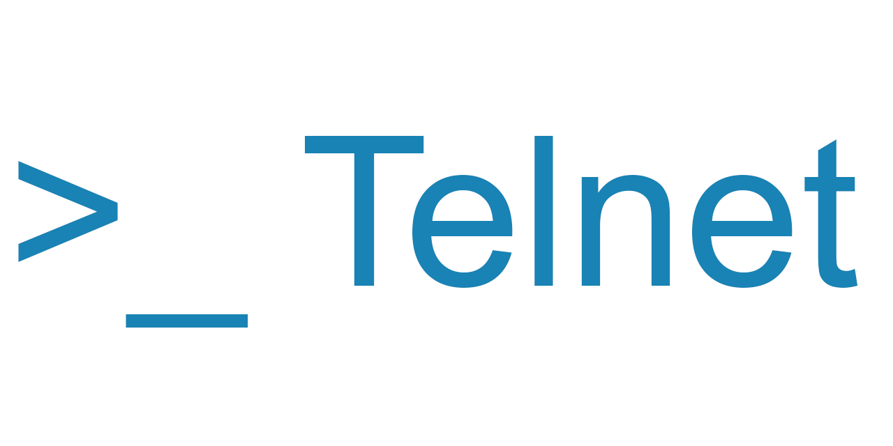

[](https://discord.gg/SK2cWERJF7) [](https://github.com/HarryCordewener/TelnetNegotiationCore/actions/workflows/dotnet.yml) [](https://www.nuget.org/packages/TelnetNegotiationCore)


# Telnet Negotiation Core
## Summary 
This project provides a library that implements telnet functionality, and as many of its RFCs are viable, in a testable manner. 
This is done with an eye on MUDs at this time, but may improve to support more terminal capabilities as time permits and if there is ask for it.

The library now features a modern plugin-based architecture with System.Threading.Channels for high-performance async processing, making it suitable for production use with proper backpressure handling and DOS protection.

All outgoing writes — negotiation responses, `SendAsync`, `SendPromptAsync`, `SendGMCPCommand`, etc. — are serialized internally via a `SemaphoreSlim` write lock. This means callers do **not** need to add their own external locking around concurrent writes on a telnet connection.

## State
This library is in a stable state. The legacy API remains fully supported for backward compatibility, while a new plugin-based architecture is available for modern applications.

## Support
| RFC                                                 | Description                        | Supported  | Comments           |
| --------------------------------------------------- | ---------------------------------- |------------| ------------------ |
| [RFC 855](http://www.faqs.org/rfcs/rfc855.html)     | Telnet Option Specification        | Full       |                    |
| [RFC 1091](http://www.faqs.org/rfcs/rfc1091.html)   | Terminal Type Negotiation          | Full       |                    |
| [MTTS](https://tintin.mudhalla.net/protocols/mtts)  | MTTS Negotiation (Extends TTYPE)   | Full       |                    |
| [RFC 1073](http://www.faqs.org/rfcs/rfc1073.html)   | Window Size Negotiation (NAWS)     | Full       |                    |
| [GMCP](https://tintin.mudhalla.net/protocols/gmcp)  | Generic Mud Communication Protocol | Full       |                    |
| [MSSP](https://tintin.mudhalla.net/protocols/mssp)  | MSSP Negotiation                   | Full       |                    |
| [RFC 885](http://www.faqs.org/rfcs/rfc885.html)     | End Of Record Negotiation          | Full       |                    | 
| [EOR](https://tintin.mudhalla.net/protocols/eor)    | End Of Record Negotiation          | Full       |                    |
| [MSDP](https://tintin.mudhalla.net/protocols/msdp)  | Mud Server Data Protocol           | Full       |                    |
| [RFC 2066](http://www.faqs.org/rfcs/rfc2066.html)   | Charset Negotiation                | Full       |                    |
| [RFC 858](http://www.faqs.org/rfcs/rfc858.html)     | Suppress GOAHEAD Negotiation       | Full       |                    |
| [RFC 1572](http://www.faqs.org/rfcs/rfc1572.html)   | New Environment Negotiation        | Full       |                    |
| [MNES](https://tintin.mudhalla.net/protocols/mnes)  | Mud New Environment Negotiation    | Full       |                    |
| [MCCP](https://tintin.mudhalla.net/protocols/mccp)  | Mud Client Compression Protocol    | Full       | MCCP2 and MCCP3    |
| [RFC 1950](https://tintin.mudhalla.net/rfc/rfc1950) | ZLIB Compression                   | Full       |                    |
| [RFC 857](http://www.faqs.org/rfcs/rfc857.html)     | Echo Negotiation                   | Full       |                    |
| [RFC 1079](http://www.faqs.org/rfcs/rfc1079.html)   | Terminal Speed Negotiation         | Full       |                    |
| [RFC 1372](http://www.faqs.org/rfcs/rfc1372.html)   | Flow Control Negotiation           | Full       |                    |
| [RFC 1184](http://www.faqs.org/rfcs/rfc1184.html)   | Line Mode Negotiation              | Full       | MODE support       |
| [RFC 1096](http://www.faqs.org/rfcs/rfc1096.html)   | X-Display Negotiation              | Full       |                    |
| [RFC 1408](http://www.faqs.org/rfcs/rfc1408.html)   | Environment Negotiation            | Full       |                    | 
| [RFC 2941](http://www.faqs.org/rfcs/rfc2941.html)   | Authentication Negotiation         | Full       |                    |
| [RFC 2946](http://www.faqs.org/rfcs/rfc2946.html)   | Encryption Negotiation             | Full       |                    |
| [MXP](https://www.zuggsoft.com/zmud/mxp.htm)       | MUD eXtension Protocol             | Full       | Telnet option 91   |

## ANSI Support, ETC?
Being a Telnet Negotiation Library, this library doesn't give support for extensions like ANSI or Pueblo at this time. MXP negotiation (telnet option 91) is supported — see the MXP protocol plugin.

## Use

### Quick Start

`BuildAndStartAsync` wires the connection and starts the read loop automatically. Pass an `IDuplexPipe` (e.g. Kestrel's `connection.Transport`), a `TcpClient`, or a raw `Stream`:

```csharp
var (telnet, readTask) = await new TelnetInterpreterBuilder()
    .UseMode(TelnetInterpreter.TelnetMode.Server)
    .UseLogger(logger)
    .OnSubmit(HandleSubmitAsync)
    .AddPlugin<NAWSProtocol>()
        .OnNAWS(HandleWindowSizeAsync)
    .AddPlugin<GMCPProtocol>()
        .OnGMCPMessage(HandleGMCPAsync)
    .AddPlugin<MSSPProtocol>()
        .OnMSSP(HandleMSSPAsync)
        .WithMSSPConfig(() => new MSSPConfig { Name = "My Server", UTF_8 = true })
    .AddPlugin<CharsetProtocol>()
        .WithCharsetOrder(Encoding.UTF8, Encoding.GetEncoding("iso-8859-1"))
    .AddPlugin<EORProtocol>()
    .AddPlugin<SuppressGoAheadProtocol>()
    .AddPlugin<MXPProtocol>()
    .BuildAndStartAsync(connection.Transport);   // IDuplexPipe (Kestrel), TcpClient, or Stream

await readTask; // completes when the connection closes
```

`AddDefaultMUDProtocols()` registers NAWS, GMCP, MSDP, MSSP, Terminal Type, Charset, EOR, Suppress Go-Ahead, and MXP in one call:

```csharp
var (telnet, readTask) = await new TelnetInterpreterBuilder()
    .UseMode(TelnetInterpreter.TelnetMode.Server)
    .UseLogger(logger)
    .OnSubmit(HandleSubmitAsync)
    .AddDefaultMUDProtocols(
        onNAWS: HandleWindowSizeAsync,
        onGMCPMessage: HandleGMCPAsync,
        msspConfig: () => new MSSPConfig { Name = "My Server", UTF_8 = true }
    )
    .BuildAndStartAsync(connection.Transport);

await readTask;
```

### Dependency Injection

Register telnet services with `AddTelnetServer()` or `AddTelnetClient()` for seamless integration with `WebApplication.CreateBuilder()` or `Host.CreateApplicationBuilder()`. The factory automatically resolves the logger from the DI container. Configure shared plugins in the registration call:

```csharp
// Program.cs — Server with WebApplication
var builder = WebApplication.CreateBuilder(args);

builder.Services.AddTelnetServer(telnet => telnet
    .AddPlugin<NAWSProtocol>()
    .AddPlugin<GMCPProtocol>()
    .AddPlugin<MSSPProtocol>()
        .WithMSSPConfig(() => new MSSPConfig { Name = "My Server", UTF_8 = true })
    .AddPlugin<TerminalTypeProtocol>()
    .AddPlugin<CharsetProtocol>()
        .WithCharsetOrder(Encoding.UTF8, Encoding.GetEncoding("iso-8859-1"))
    .AddPlugin<EORProtocol>()
    .AddPlugin<SuppressGoAheadProtocol>()
    .AddPlugin<MXPProtocol>());

builder.WebHost.UseKestrel(options =>
    options.ListenLocalhost(4202, listenOptions =>
        listenOptions.UseConnectionHandler<MyConnectionHandler>()));

var app = builder.Build();
await app.RunAsync();
```

```csharp
// ConnectionHandler — inject ITelnetInterpreterFactory
public class MyConnectionHandler(
    ILogger<MyConnectionHandler> logger,
    ITelnetInterpreterFactory telnetFactory) : ConnectionHandler
{
    public override async Task OnConnectedAsync(ConnectionContext connection)
    {
        var (telnet, readTask) = await telnetFactory.CreateBuilder()
            .OnSubmit(WriteBackAsync)
            .BuildAndStartAsync(connection.Transport);

        await readTask;
    }
}
```

```csharp
// Program.cs — Client with Host.CreateApplicationBuilder
var builder = Host.CreateApplicationBuilder(args);

builder.Services.AddTelnetClient(telnet => telnet
    .AddDefaultMUDProtocols());
builder.Services.AddTransient<MyTelnetClient>();

var host = builder.Build();
await host.Services.GetRequiredService<MyTelnetClient>().ConnectAsync();
```

### Fluent Configuration Reference

All plugin callbacks and settings are set inline on the builder:

- `.OnNAWS((height, width) => ...)` — window size changes
- `.OnGMCPMessage(msg => ...)` — GMCP messages
- `.OnMSSP(config => ...)` — MSSP requests
- `.OnMSDPMessage((telnet, data) => ...)` — MSDP messages
- `.OnPrompt(() => ...)` — EOR / Suppress Go-Ahead prompt signals
- `.WithMSSPConfig(() => new MSSPConfig { ... })` — server advertisement data
- `.WithCharsetOrder(Encoding.UTF8, ...)` — encoding preference order
- `.WithTTableSupport(true)` / `.OnTTableReceived(...)` / `.OnTTableRequested(...)` — TTABLE support (RFC 2066)
- `.OnMXPEnabled(() => ...)` — MXP negotiation success
- `.WithKeepAlive()` — idle keep-alive (off by default, see below)
- `.WithMaxMessageSize(bytes)` / `.OnGMCPMessageTooLarge(...)` / `.OnMSDPMessageTooLarge(...)` / `.OnMSSPMessageTooLarge(...)` — subnegotiation size limits (see below)
- `.WithMaxTTableSize(bytes)` — TTABLE size limit (RFC 2066)
- `.WithReplyTimeout(...)` — plaintext MSSP reply ceiling (`MSSPPlaintextProtocol`, see below)
- `.WithMaxBufferSize(bytes)` — longest line of ordinary input the interpreter will assemble (default 5 MiB; a longer line is dropped, not truncated)

### Subnegotiation Size Limits

GMCP, MSDP, MSSP and CHARSET TTABLE payloads arrive from an untrusted peer, so each is bounded. The
default is **1 MiB per message**, configurable per protocol:

```csharp
.AddPlugin<GMCPProtocol>()
    .OnGMCPMessage(HandleGMCPAsync)
    .WithMaxMessageSize(256 * 1024)                 // default: 1 MiB
    .OnGMCPMessageTooLarge(x => LogDroppedAsync(x)) // (Package, ReceivedBytes, MaxMessageSize)
```

None of the GMCP, MSDP or MSSP specifications defines a maximum message size, so the limit is a
library policy, not a protocol constant. Messages that exceed it are **dropped, never truncated** —
half a JSON document is invalid JSON, and a consumer cannot tell it apart from a malformed server.
Reaching the limit is never silent, but what is reported differs per protocol:

| Protocol | At the ceiling |
| --- | --- |
| GMCP | `Error` log naming the package, the bytes received and the limit; `OnGMCPMessageTooLarge((Package, ReceivedBytes, MaxMessageSize))` |
| MSDP | `Error` log with the bytes received and the limit; `OnMSDPMessageTooLarge((ReceivedBytes, MaxMessageSize))` — MSDP messages have no package name |
| MSSP | `Error` log with the bytes received and the limit; `OnMSSPMessageTooLarge((ReceivedBytes, MaxMessageSize))`. The count is over the whole report — every variable name and value together — because a report of a hundred thousand tiny variables costs the same memory as one enormous value |
| CHARSET TTABLE | `Error` log with the bytes received and the limit, plus a `TTABLE-REJECTED` reply to the peer, which is what RFC 2066 provides for this case. No callback: the `OnTTableReceived` callback is never handed a partial table |

The connection is unaffected in every case; the next message is processed normally.

Ordinary (non-negotiation) input is bounded too. A peer decides when to send a newline, so the line
the interpreter assembles is the one accumulator a peer can grow simply by never terminating a line;
`.WithMaxBufferSize(bytes)` sets that ceiling (default 5 MiB). A line past it is dropped whole, with
an `Error` log, and the connection carries on with the next.

### Reading MSSP

`MSSPConfig` has strongly typed properties for every variable [the specification](https://tintin.mudhalla.net/protocols/mssp) defines, but those cannot represent MSSP on their own: a variable may carry **several values** — spelled either as repeated `MSSP_VAL` under one `MSSP_VAR`, or as the same `MSSP_VAR` repeated — and a server may send names this library has never heard of. `MSSPConfig.Variables` is the lossless record every property is projected from:

```csharp
ValueTask HandleMSSPAsync(MSSPConfig config)
{
    // Convenient scalars. For a multi-valued variable this is the *last* value,
    // which the specification defines as the default.
    Console.WriteLine(config.Name);            // "Test MUD"
    Console.WriteLine(config.Port);            // 4201, from PORT "80" "23" "4201"

    // Everything the server actually said, in wire order.
    foreach (var (variable, values) in config.Variables)
        Console.WriteLine($"{variable} = {string.Join(", ", values)}");

    var ports    = config.Variables["PORT"];          // ["80", "23", "4201"]
    var referral = config.Referral;                   // every REFERRAL entry
    var charset  = config.Variables.Default("CHARSET");
    var crawl    = config.Variables.Integer("CRAWL DELAY");  // -1 means "your default"
    var ansi     = config.Variables.Flag("ANSI");

    // Variables with no typed property — unofficial extras and invented names — are
    // kept too, in Variables and in Extended (as IReadOnlyList<string>).
    foreach (var name in config.Variables.UnofficialNames)
        Console.WriteLine($"{name} = {string.Join(", ", config.Variables[name])}");

    return ValueTask.CompletedTask;
}
```

Variable names are canonicalized to the specification's spaced, upper-case spelling, so the recommended underscore substitution reads back the same: `config.Variables["CRAWL_DELAY"]`, `config.Variables["CRAWL DELAY"]` and `config.Variables["crawl delay"]` are one variable.

When **sending**, a `MSSPConfig` you build by hand behaves exactly as before — set the properties, or add to `Extended`. A config you received from a peer round-trips verbatim, arrays and unknown variables included.

MSSP mandates no character set — its only byte-level rule is that *"variables and values cannot contain the MSSP_VAL, MSSP_VAR, IAC, or NUL byte"*, and its own `CHARSET` variable reports *"ASCII, BIG5, CP437, CP949, CP1251, EUC-KR, GB18030, ISO-8859-1, ISO-8859-2, KOI8-R, UTF-8"* — so a report is read and written with `TelnetInterpreter.CurrentEncoding`, whatever RFC 2066 CHARSET negotiation has settled on (UTF-8 until it settles on something else).

### Window Size (NAWS)

A server learns the client's window through `.OnNAWS((height, width) => ...)`, and reads the latest
values back from `telnet.ClientWidth` / `telnet.ClientHeight`.

A client **reports** its window with `NAWSProtocol.SendWindowSizeAsync`, including whenever the
terminal is resized:

```csharp
var naws = telnet.PluginManager!.GetPlugin<NAWSProtocol>();
await naws!.SendWindowSizeAsync(width: 132, height: 43);
```

Nothing goes out until the server has enabled NAWS with `DO NAWS` (RFC 1073 — an unsolicited
`SB NAWS` desyncs a strict server's parser); `NAWSProtocol.WindowSizeReportingEnabled` says whether
it has. Both dimensions are 16-bit **unsigned**, which is the option's whole reason for existing —
*"the 253 character height and width limitation is too low so the new option has a limit of 65535
characters"* — so anything from `0` to `NAWSProtocol.MaxWindowDimension` (65535) can be reported.
A value outside that range throws `ArgumentOutOfRangeException` rather than being truncated into
the two bytes the wire has.

### Plaintext MSSP (`MSSP-REQUEST`)

A sizeable population of servers answers MSSP as **plain text** at the login screen as well as over
telnet option 70. The client sends the literal line `MSSP-REQUEST`; the server answers with a leading
CRLF, a start marker, tab-separated `name<TAB>value` lines, and an end marker:

```text
\r\nMSSP-REPLY-START\r\n
NAME<TAB>Some MUD\r\n
PLAYERS<TAB>4\r\n
MSSP-REPLY-END\r\n
```

The vocabulary is the same one — multi-word official names included — so it lands in the same
`MSSPConfig` and arrives through the same `OnMSSP` callback. It lives in its own plugin, and
**adding that plugin is the entire opt-in**:

```csharp
.AddPlugin<MSSPProtocol>()
    .OnMSSP(HandleMSSPAsync)
    .WithMSSPConfig(() => new MSSPConfig { Name = "My Server" })
.AddPlugin<MSSPPlaintextProtocol>()          // ← the opt-in; nothing else to switch on
    .WithReplyTimeout(TimeSpan.FromSeconds(10))
```

`MSSPPlaintextProtocol` depends on `MSSPProtocol` — it borrows that plugin's `OnMSSP` callback, its
`MaxMessageSize` and its `WithMSSPConfig` provider rather than duplicating them — so adding it alone
throws at `BuildAsync()` rather than going quiet on the wire.

**As a server, it is automatic.** An incoming `MSSP-REQUEST` line (matched case-insensitively, as
SMAUG's `str_cmp` does) is answered from your `WithMSSPConfig` and **consumed**, which means
`MSSP-REQUEST` stops being usable as a character name on your server. That is the whole consequence
of adding the plugin, and adding it is the consent to it.

**As a client, nothing is sent until you ask.** Unlike `IAC DO 70`, which is pure negotiation that a
non-supporting server ignores, this puts real text at a stranger's login prompt — two hosts probed
while this was written replied `Illegal name, try another.` and re-prompted:

```csharp
var plaintext = telnet.PluginManager!.GetPlugin<MSSPPlaintextProtocol>()!;

MSSPConfig? report = await plaintext.RequestReportAsync(cancellationToken);

if (report is null)
{
    // No answer: no plaintext MSSP, or it never finished, or it was over the ceiling.
}
```

The report is returned to the caller *and* delivered to `OnMSSP`, so a consumer already wired for
option 70 needs no new plumbing, while a crawler gets the value at the call site where it knows which
host it just asked.

**There is deliberately no timer.** No version of the MSSP specification gives timing for this
exchange — the only timing concept MSSP has is `CRAWL DELAY`, which is *hours between crawls*, not
when to speak within a connection. Grapevine's crawler asks 10 seconds after connecting and gives up
at 20, but that is [one crawler's published policy](https://grapevine.haus/mssp), and a library that
baked it in would be choosing, for every consumer, the moment to put text on a stranger's login
prompt — by which time an interactive client may already have sent a character name. Rebuilding that
exact policy on top of the explicit call is three lines, and all of it stays yours:

```csharp
// The telnet option may already have answered through OnMSSP by now.
MSSPConfig? report = null;

await Task.Delay(TimeSpan.FromSeconds(10), token);
if (report is null)
    report = await plaintext.RequestReportAsync(token);   // ReplyTimeout bounds the wait
```

Behaviour once the plugin is added:

| | |
| --- | --- |
| Client sends | `MSSP-REQUEST\r\n`, only from `RequestReportAsync`, once per call |
| Returns | the `MSSPConfig`, or `null` whenever the peer produced no report: never answered, reply never ended, reply over the ceiling, connection gone. Not an error — a server without the form is the ordinary case. Caller-side faults (already-cancelled token, disabled plugin) throw rather than returning `null` |
| Telnet option | untouched. This is a second transport, not a replacement; both can answer on one connection and each report says which it came from |
| Markers | matched as **whole lines**, not as substrings, so a MUD that merely says the words in output does not trip the parser |
| Field split | on the **first tab** only, so `MINIMUM AGE`, `PAY TO PLAY` and `XTERM 256 COLORS` survive, and so do values containing spaces |
| Size ceiling | `MSSPProtocol.MaxMessageSize`, counted over the reply's field lines. Over it the reply is **dropped, never truncated**, with an `Error` log and `OnMSSPMessageTooLarge((ReceivedBytes, MaxMessageSize))`; the call returns `null` |
| Reply ceiling | `ReplyTimeout` (default 10 s) bounds a caller that passes `CancellationToken.None`. Cancelling your own token throws `OperationCanceledException`; the ceiling and a dead connection return `null`, because those are answers about the peer |
| Encoding | `TelnetInterpreter.CurrentEncoding`, as on the subnegotiation path. `IAC` among the encoded bytes is doubled (RFC 854); a tab or line ending inside a name or value is replaced with a space, because this framing has no escape for one |
| Lines consumed | everything from the start marker to the end marker, so the reply never reaches your `OnSubmit` as if a user had typed it |

Which transport answered is part of the value, since the two can disagree:

```csharp
ValueTask HandleMSSPAsync(MSSPConfig config)
{
    // MSSPSource.TelnetOption, MSSPSource.Plaintext, or MSSPSource.Unspecified
    // for a config you built by hand rather than received.
    Console.WriteLine(config.Source);
    return ValueTask.CompletedTask;
}
```

**Specification status, stated plainly.** The plaintext form is *not* described on the current
[specification page](https://tintin.mudhalla.net/protocols/mssp/), nor on the mudstandards mirror.
That page's own [changelog](https://tintin.mudhalla.net/protocols/mssp/news.php) records *"Mar 20,
2009 - Plaintext version of MSSP finalized and added to specification"*, and the implementation ships
in the SMAUG family (`Arthmoor/SmaugFUSS` `src/mssp.c`, and the codebases derived from it) and is
read by Grapevine's crawler. So: it was specified, the specification page no longer carries it, and
it is deployed anyway — more widely implemented than it is currently documented. This library's
framing is matched against SmaugFUSS and exercised against a scripted peer; **no live host was
contacted to confirm it.**

### Keep-Alive

Off unless you ask for it. `WithKeepAlive()` sends `IAC NOP` after 30 seconds of outbound silence, which keeps NAT tables, load balancers and idle timers from tearing down a quiet connection:

```csharp
var (telnet, readTask) = await new TelnetInterpreterBuilder()
    .UseMode(TelnetInterpreter.TelnetMode.Server)
    .UseLogger(logger)
    .OnSubmit(HandleSubmitAsync)
    .WithKeepAlive()                              // IAC NOP after 30s of silence
    .AddDefaultMUDProtocols()
    .BuildAndStartAsync(connection.Transport);
```

The interval is an **idle** window, not a fixed heartbeat: every outbound write restarts it, so a connection that is already sending data never sends anything extra. Both the interval and the payload are configurable:

```csharp
    .WithKeepAlive(TimeSpan.FromSeconds(90))      // custom idle window

    .WithKeepAlive(TimeSpan.FromMinutes(2), async (telnet, token) =>
        await telnet.SendAsync(Encoding.ASCII.GetBytes("\r\n")))   // custom payload
```

The interval must be between **1 second** (`TelnetInterpreter.MinimumKeepAliveInterval`) and **24 hours** (`TelnetInterpreter.MaximumKeepAliveInterval`); the default is 30 seconds (`TelnetInterpreter.DefaultKeepAliveInterval`). Anything outside that range throws `ArgumentOutOfRangeException` rather than being quietly clamped, so a mistyped interval fails where you wrote it instead of running at a value you did not choose. Below a second a keep-alive is a flood — nothing it defends against, from NAT eviction to load balancer idle timeouts, is measured in anything shorter. Above a day it cannot keep anything alive, since every idle timeout in the path fires long before that, and the wait would be approaching the point where `Task.Delay` refuses the interval outright.

Works in both client and server mode. If the send throws — usually because the peer is gone — the exception is logged as a warning and the keep-alive stops for that connection. It is never rethrown onto your application and it does not disturb the byte-processing loop; you find out the connection is dead the same way you do today, from your read loop completing.

> **A NOP keep-alive is not peer-liveness detection.** A successful send only proves the local write succeeded — the peer is not required to answer, so a peer that has silently vanished is not noticed until TCP retransmission gives up. Confirming the peer is alive needs a round trip it must answer, such as TIMING-MARK (RFC 860, option 6), which this library does not implement.

### Manual Connection Management

If you need control over the read loop, use `UsePipe` or `UseStream` to wire only the write side:

```csharp
var telnet = await new TelnetInterpreterBuilder()
    .UseMode(TelnetInterpreter.TelnetMode.Server)
    .UseLogger(logger)
    .OnSubmit(HandleSubmitAsync)
    .UsePipe(connection.Transport)   // wires OnNegotiation → pipe.Output
    .AddPlugin<NAWSProtocol>()
    .BuildAsync();

await TelnetInterpreterBuilder.ReadFromPipeAsync(telnet, connection.Transport.Input, cancellationToken);
```

Or supply `OnNegotiation` and manage the loop entirely:

```csharp
var telnet = await new TelnetInterpreterBuilder()
    .UseMode(TelnetInterpreter.TelnetMode.Server)
    .UseLogger(logger)
    .OnSubmit(HandleSubmitAsync)
    .OnNegotiation(data => WriteToNetworkAsync(data))
    .AddPlugin<NAWSProtocol>()
    .BuildAsync();

while (true)
{
    var result = await connection.Transport.Input.ReadAsync();
    foreach (var segment in result.Buffer)
        await telnet.InterpretByteArrayAsync(segment);
    if (result.IsCompleted) break;
    connection.Transport.Input.AdvanceTo(result.Buffer.End);
}
```

### Client
A documented example exists in the [TestClient Project](TelnetNegotiationCore.TestClient/MockPipelineClient.cs).

```csharp
var (telnet, readTask) = await new TelnetInterpreterBuilder()
    .UseMode(TelnetInterpreter.TelnetMode.Client)
    .UseLogger(logger)
    .OnSubmit(WriteBackAsync)
    .WithClientIdentity(new ClientIdentity("MY-CLIENT")
    {
        Version = "1.0.0",
        TerminalType = "XTERM",
        Mtts = MttsCapabilities.Ansi | MttsCapabilities.Colors256
    })
    .AddPlugin<NAWSProtocol>()
    .AddPlugin<GMCPProtocol>()
        .OnGMCPMessage(SignalGMCPAsync)
    .AddPlugin<MSSPProtocol>()
        .OnMSSP(SignalMSSPAsync)
    .AddPlugin<TerminalTypeProtocol>()
    .AddPlugin<CharsetProtocol>()
        .WithCharsetOrder(Encoding.UTF8, Encoding.GetEncoding("iso-8859-1"))
    .AddPlugin<EORProtocol>()
        .OnPrompt(SignalPromptAsync)
    .AddPlugin<SuppressGoAheadProtocol>()
    .BuildAndStartAsync(tcpClient);

// readTask completes when the server closes the connection
await readTask;
```

### Saying who your application is

A client introduces itself down two channels — TTYPE (where MTTS defines the first response as the
*client name*) and MNES `CLIENT_NAME` — and both are the same fact, so you set it once:

```csharp
.WithClientIdentity(new ClientIdentity("MUINDEX-CRAWLER")
{
    Version = "1.2.0",                                     // MNES CLIENT_VERSION
    TerminalType = "XTERM",                                // 2nd TTYPE response, MNES TERMINAL_TYPE
    Mtts = MttsCapabilities.Ansi | MttsCapabilities.Truecolor
})
```

With that, TTYPE answers `MUINDEX-CRAWLER`, then `XTERM`, then `MTTS <bitvector>`, and a server that
negotiates NEW-ENVIRON receives `CLIENT_NAME`, `CLIENT_VERSION`, `TERMINAL_TYPE` and `MTTS`.

**Configure nothing and the library names nobody.** TTYPE answers `UNKNOWN` — RFC 1091's own word for
a terminal that will not name itself — and NEW-ENVIRON sends no variables at all. It will never
introduce your application as `TNC`, and it will never invent a terminal for it.

**The MTTS bitvector is calculated, not stated.** `Mtts` is only for the claims this library cannot
check: colour depth, mouse tracking, a screen reader — things it does not render and cannot see. The
bits it *can* see, it sets for you, and only when they are true:

| Bit | Set when |
| --- | --- |
| `Utf8` (4) | the interpreter is decoding UTF-8 (the default, until RFC 2066 CHARSET says otherwise) |
| `Mnes` (512) | a `NewEnvironProtocol` plugin is registered, so this connection really will answer MNES |

Your claim and the observed bits are OR-ed together, so a client that renders ANSI and truecolour and
has NEW-ENVIRON registered reports `MTTS 773`. An application that would rather state the whole TTYPE
list itself can bypass all of this:

```csharp
.AddPlugin<TerminalTypeProtocol>()
    .WithTerminalTypes("MUINDEX-CRAWLER", "MUINDEX", "MTTS 9")   // sent verbatim, in this order
```

### Sending GMCP Messages
Both clients and servers can send GMCP messages using the `SendGMCPCommand` method. The method takes a package name and JSON data.

```csharp
// Send a simple GMCP message
await telnet.SendGMCPCommand("Core.Hello", "{\"client\":\"MyClient\",\"version\":\"1.0\"}");

// Send character vitals
await telnet.SendGMCPCommand("Char.Vitals", "{\"hp\":1000,\"maxhp\":1500,\"mp\":500,\"maxmp\":800}");

// Send room information
await telnet.SendGMCPCommand("Room.Info", "{\"num\":12345,\"name\":\"A dark room\",\"area\":\"The Dungeon\"}");

// The telnet interpreter will automatically handle GMCP negotiation
// Messages will only be sent if the remote party supports GMCP
```

To receive GMCP messages, use the `OnGMCPMessage` callback as shown in the initialization example above.

#### Messages without a data section

The GMCP specification says the data field "is optional and should be separated from the package
field with a space", and that "when sending a command without a data section the space should be
omitted". A bodyless message such as `Core.Ping` is delivered with `Package = "Core.Ping"` and
**`Info = ""`** — an empty string, not `"{}"`. The tuple reports what was on the wire; a consumer
that would rather see an empty object can substitute one:

```csharp
ValueTask HandleGMCPAsync((string Package, string Info) message)
{
    var json = string.IsNullOrEmpty(message.Info) ? "{}" : message.Info;
    ...
}
```

A message that runs its data straight into the package name with no space (`Char.Vitals{"hp":1}`)
is malformed by that same sentence, but a package name cannot contain `{`, so it is accepted —
split at the first character that cannot belong to a package name — and logged as a warning naming
the package. A payload with no package name at all is discarded, also with a warning that quotes
what was thrown away.

#### MSDP over GMCP (MoG)

GMCP can carry MSDP. The specification: *"When using MoG (MSDP over GMCP) the package name is
considered case sensitive and MSDP must be fully capitalized"*, and *"the data field must use the
JSON data syntax with keywords being case sensitive using UTF-8 encoding"* — so MoG is JSON, not
MSDP's own byte encoding:

```
client - IAC SB GMCP 'MSDP {"LIST" : "COMMANDS"}' IAC SE
server - IAC SB GMCP 'MSDP {"COMMANDS" : ["LIST", "REPORT", "RESET", "SEND", "UNREPORT"]}' IAC SE
```

A message whose package is exactly `MSDP` is routed to `OnMSDPMessage` with its data section
forwarded verbatim, which is the same JSON shape a native `IAC SB MSDP` subnegotiation produces
(MSDP tables are JSON objects, MSDP arrays are JSON arrays). Consequences worth knowing:

- The package name is matched **case sensitively**. A `msdp` package is an ordinary GMCP package
  and goes to `OnGMCPMessage`.
- A data section that is not valid JSON is **discarded with an `Error` log** rather than forwarded:
  the callback's contract is JSON. Nothing is thrown onto the read loop, and the connection carries
  on with the next message.
- If no `MSDPProtocol` plugin is registered, a MoG message is delivered to `OnGMCPMessage` with
  `Package = "MSDP"` instead of being dropped.

### Using ENVIRON Protocol
The ENVIRON protocol (RFC 1408) is the original environment variable negotiation protocol. It's simpler than NEW-ENVIRON and supports only basic environment variables (no user variables). This protocol can be activated in isolation.

#### Server Side
```csharp
var telnet = await new TelnetInterpreterBuilder()
    .UseMode(TelnetInterpreter.TelnetMode.Server)
    .UseLogger(logger)
    .OnSubmit((data, encoding, telnet) => HandleSubmitAsync(data, encoding, telnet))
    .OnNegotiation((data) => WriteToNetworkAsync(data))
    .AddPlugin<EnvironProtocol>()
        .OnEnvironmentVariables((envVars) => 
        {
            // envVars contains standard environment variables (USER, LANG, etc.)
            logger.LogInformation("Received {EnvCount} environment variables", envVars.Count);
            foreach (var (key, value) in envVars)
            {
                logger.LogInformation("  {Key} = {Value}", key, value);
            }
            return ValueTask.CompletedTask;
        })
    .BuildAsync();
```

#### Client Side
The client answers a server's request for environment variables with **exactly what you configured,
and nothing else**. Configure nothing and it answers with an empty list — no `USER`, no `LANG`, and
in particular nothing read out of the environment of the process:

```csharp
// Option 1: send nothing (the default)
var telnet = await new TelnetInterpreterBuilder()
    .UseMode(TelnetInterpreter.TelnetMode.Client)
    .UseLogger(logger)
    .OnSubmit((data, encoding, telnet) => HandleSubmitAsync(data, encoding, telnet))
    .OnNegotiation((data) => WriteToNetworkAsync(data))
    .AddPlugin<EnvironProtocol>()
    .BuildAsync();

// Option 2: Configure custom environment variables
var telnet = await new TelnetInterpreterBuilder()
    .UseMode(TelnetInterpreter.TelnetMode.Client)
    .UseLogger(logger)
    .OnSubmit((data, encoding, telnet) => HandleSubmitAsync(data, encoding, telnet))
    .OnNegotiation((data) => WriteToNetworkAsync(data))
    .AddPlugin<EnvironProtocol>()
        .WithClientEnvironmentVariables(new Dictionary<string, string>
        {
            { "USER", "myusername" },
            { "LANG", "en_US.UTF-8" },
            { "TERM", "xterm-256color" }
        })
    .BuildAsync();
```

**Note:** If you need user-defined variables or more advanced features, use `NewEnvironProtocol` (RFC 1572) instead. Both protocols can coexist if needed.

### Using TTABLE (Translation Tables) with Charset Protocol
The TTABLE feature of RFC 2066 Charset protocol allows negotiation of custom character set translation tables. This is useful for specialized character mappings, legacy systems, or private character sets not registered with IANA.

#### Server Side
```csharp
var telnet = await new TelnetInterpreterBuilder()
    .UseMode(TelnetInterpreter.TelnetMode.Server)
    .UseLogger(logger)
    .OnSubmit((data, encoding, telnet) => HandleSubmitAsync(data, encoding, telnet))
    .OnNegotiation((data) => WriteToNetworkAsync(data))
    .AddPlugin<CharsetProtocol>()
        .WithCharsetOrder(Encoding.UTF8, Encoding.GetEncoding("iso-8859-1"))
        .WithTTableSupport(true)
        .OnTTableReceived(async (ttableData) => 
        {
            // Parse and validate the TTABLE data
            // Version 1 format: <version> <sep> <charset1> <sep> <size1> <count1> <charset2> <sep> <size2> <count2> <map1> <map2>
            logger.LogInformation("Received TTABLE with {Bytes} bytes", ttableData.Length);
            
            // Validate the table structure
            if (ttableData.Length < 2 || ttableData[0] != 1)
            {
                logger.LogWarning("Invalid TTABLE version or format");
                return false; // NAK - request retransmission
            }
            
            // Store or apply the translation table
            await StoreTranslationTable(ttableData);
            return true; // ACK - accept the table
        })
    .BuildAsync();
```

The server automatically announces charset support and can receive TTABLE data when the client sends a translation table.

#### Client Side
```csharp
var telnet = await new TelnetInterpreterBuilder()
    .UseMode(TelnetInterpreter.TelnetMode.Client)
    .UseLogger(logger)
    .OnSubmit((data, encoding, telnet) => HandleSubmitAsync(data, encoding, telnet))
    .OnNegotiation((data) => WriteToNetworkAsync(data))
    .AddPlugin<CharsetProtocol>()
        .WithTTableSupport(true)
        .OnTTableRequested(async () => 
        {
            // Generate custom translation table
            // Return null to reject the request
            return BuildCustomTTable("custom-charset", "utf-8");
        })
    .BuildAsync();
```

#### Programmatic TTABLE API
You can also send TTABLE messages programmatically:

```csharp
// Get the charset plugin
var charsetPlugin = telnet.PluginManager!.GetPlugin<CharsetProtocol>();

// Send a TTABLE-IS message
var ttableData = BuildTTableVersion1("my-charset", "utf-8", translationMap);
await charsetPlugin!.SendTTableAsync(ttableData);

// Reject a TTABLE request
await charsetPlugin!.SendTTableRejectedAsync();
```

#### TTABLE Version 1 Format
The TTABLE version 1 format is defined in RFC 2066:
- **Version byte**: Always 1 for version 1
- **Separator**: Single byte separator character (e.g., ';' or ' ')
- **Charset 1 name**: ASCII string terminated by separator
- **Size 1**: 1 byte indicating bits per character (typically 8)
- **Count 1**: 3 bytes (network byte order) indicating number of characters in map
- **Charset 2 name**: ASCII string terminated by separator
- **Size 2**: 1 byte indicating bits per character
- **Count 2**: 3 bytes (network byte order) indicating number of characters in map
- **Map 1**: Translation from charset 1 to charset 2
- **Map 2**: Translation from charset 2 to charset 1

**Note:** TTABLE is an advanced feature. Most applications should use standard named character sets via the regular charset negotiation. TTABLE is primarily useful for legacy systems or specialized character mappings not available as standard encodings.

### Using NEW-ENVIRON Protocol
The NEW-ENVIRON protocol (RFC 1572) allows exchange of environment variables between client and server. MNES (Mud New Environment Standard) extends this with the MTTS flag 512.

#### Server Side
```csharp
var telnet = await new TelnetInterpreterBuilder()
    .UseMode(TelnetInterpreter.TelnetMode.Server)
    .UseLogger(logger)
    .OnSubmit((data, encoding, telnet) => HandleSubmitAsync(data, encoding, telnet))
    .OnNegotiation((data) => WriteToNetworkAsync(data))
    .AddPlugin<NewEnvironProtocol>()
        .OnEnvironmentVariables((envVars, userVars) => 
        {
            // envVars contains standard environment variables (USER, LANG, etc.)
            // userVars contains user-defined variables
            logger.LogInformation("Received {EnvCount} environment variables", envVars.Count);
            foreach (var (key, value) in envVars)
            {
                logger.LogInformation("  {Key} = {Value}", key, value);
            }
            return ValueTask.CompletedTask;
        })
    .BuildAsync();
```

#### Client Side
The client answers a server's `SEND` with **exactly what you configured, and nothing else**. Nothing
is read from the environment of the process: RFC 1572's `USER` means *the account to log in as*, not
the operating-system account the client happens to run under, and a server has no business learning
the latter.

Most of what a MUD client wants to send here is its identity, so set that once and it feeds both
NEW-ENVIRON and TTYPE:

```csharp
var telnet = await new TelnetInterpreterBuilder()
    .UseMode(TelnetInterpreter.TelnetMode.Client)
    .UseLogger(logger)
    .OnSubmit((data, encoding, telnet) => HandleSubmitAsync(data, encoding, telnet))
    .OnNegotiation((data) => WriteToNetworkAsync(data))
    .WithClientIdentity(new ClientIdentity("MY-CLIENT") { Version = "1.0.0" })
    .AddPlugin<NewEnvironProtocol>()
    .BuildAsync();

// The server receives CLIENT_NAME, CLIENT_VERSION and the calculated MTTS when it asks.
```

Anything else — including a `USER` your application has genuinely decided to send — goes in the
variable map, where an entry overrides the identity-derived one of the same name:

```csharp
    .AddPlugin<NewEnvironProtocol>()
        .WithClientEnvironmentVariables(new Dictionary<string, string>
        {
            { "CHARSET", "UTF-8" },
            { "WORD_WRAP", "OFF" }
        })
```

Configure neither and a `SEND` is answered with an empty `IS`, which leaves the server in the same
position as one talking to a client that never negotiated NEW-ENVIRON at all.

A server may ask for particular variables rather than all of them, and the reply answers the request
that was made: only the variables it named, in the order it named them. A name you did not configure
comes back *undefined* — the name with no value, which is RFC 1572's way of saying "I have none" —
so a server that asks for `USER` is told there isn't one rather than being handed the account name
of whoever is running the client. A variable you configured with an empty string is a different
answer: it is defined, and empty.

#### MNES Support
MNES (Mud New Environment Standard) defines the variable names above — `CLIENT_NAME`,
`CLIENT_VERSION`, `TERMINAL_TYPE`, `MTTS`, `CHARSET`, `IPADDRESS` — and is advertised with MTTS flag
512. That flag is set for you, and only when it is true: registering a `NewEnvironProtocol` plugin is
what makes this connection able to answer MNES, so that is exactly when the bit goes out. See
[Saying who your application is](#saying-who-your-application-is).

### Using MCCP Protocol
The MCCP (Mud Client Compression Protocol) provides bandwidth reduction through zlib compression. MCCP2 compresses server-to-client data, while MCCP3 compresses client-to-server data.

Both work the same way: the side that is about to compress sends `IAC SB MCCPn IAC SE`, and from the byte after that `SE` everything it sends in that direction — text *and* telnet negotiation — is one continuous zlib stream that never returns to plain telnet. This library handles that with a stream transform installed on the interpreter: inbound bytes are inflated before the telnet state machine sees them, and outbound writes are deflated after everything else in the library has had its say. There is no per-message compression call, because MCCP has no messages.

#### Server Side
```csharp
var telnet = await new TelnetInterpreterBuilder()
    .UseMode(TelnetInterpreter.TelnetMode.Server)
    .UseLogger(logger)
    .OnSubmit((data, encoding, telnet) => HandleSubmitAsync(data, encoding, telnet))
    .OnNegotiation((data) => WriteToNetworkAsync(data))
    .AddPlugin<MCCPProtocol>()
        .OnCompressionEnabled((version, enabled) => 
        {
            logger.LogInformation("MCCP{Version} compression {State}", 
                version, enabled ? "enabled" : "disabled");
            return ValueTask.CompletedTask;
        })
    .BuildAsync();
```

The server automatically announces MCCP2 and MCCP3 support. When the client answers `DO MCCP2` the server sends the marker and compresses everything it writes from then on; when the client sends its own `IAC SB MCCP3 IAC SE` the server starts inflating everything it reads.

#### Client Side
The client automatically responds to server MCCP offers. On `IAC SB MCCP2 IAC SE` it starts inflating everything the server sends; when the server offers MCCP3 it starts compressing everything it writes.

```csharp
var telnet = await new TelnetInterpreterBuilder()
    .UseMode(TelnetInterpreter.TelnetMode.Client)
    .UseLogger(logger)
    .OnSubmit((data, encoding, telnet) => HandleSubmitAsync(data, encoding, telnet))
    .OnNegotiation((data) => WriteToNetworkAsync(data))
    .AddPlugin<MCCPProtocol>()
        .OnCompressionEnabled((version, enabled) => 
        {
            logger.LogInformation("MCCP{Version} compression {State}", 
                version, enabled ? "enabled" : "disabled");
            return ValueTask.CompletedTask;
        })
    .BuildAsync();

// Compression is handled automatically - no manual intervention needed.
// OnSubmit still receives plain text, and OnNegotiation is still given plain
// telnet: the compression happens on the far side of both callbacks.
```

#### Benefits
- **MCCP2**: Reduces server-to-client bandwidth by 75-90%
- **MCCP3**: Reduces client-to-server bandwidth and provides security through obscurity
- **Automatic**: Compression/decompression is transparent once negotiated, including for telnet negotiation that arrives inside the compressed stream
- **Standards-compliant**: Uses zlib (RFC 1950) compression via `System.IO.Compression.ZLibStream` (SharpZipLib on `netstandard2.0`), as one stream per connection per direction

#### Failure handling
A deflate stream that goes wrong cannot be resynchronized, so if the peer's compressed stream turns out not to be valid zlib the inflater stops for good: the error is logged, `IsMCCP2Enabled` / `IsMCCP3Enabled` goes back to `false`, and nothing further is delivered from that direction rather than garbage being delivered.

### Using Terminal Speed Protocol
The Terminal Speed protocol (RFC 1079) allows clients and servers to exchange terminal speed information (transmit and receive speeds in bits per second).

#### Server Side
```csharp
var telnet = await new TelnetInterpreterBuilder()
    .UseMode(TelnetInterpreter.TelnetMode.Server)
    .UseLogger(logger)
    .OnSubmit((data, encoding, telnet) => HandleSubmitAsync(data, encoding, telnet))
    .OnNegotiation((data) => WriteToNetworkAsync(data))
    .AddPlugin<TerminalSpeedProtocol>()
        .OnTerminalSpeed((transmitSpeed, receiveSpeed) => 
        {
            logger.LogInformation("Client terminal speed: {Transmit} bps transmit, {Receive} bps receive",
                transmitSpeed, receiveSpeed);
            return ValueTask.CompletedTask;
        })
    .BuildAsync();
```

The server automatically announces support and requests terminal speed from clients that support it.

#### Client Side
The client automatically responds to server requests for terminal speed. You can customize the speeds to send:

```csharp
// Option 1: Use defaults (38400 bps transmit and receive)
var telnet = await new TelnetInterpreterBuilder()
    .UseMode(TelnetInterpreter.TelnetMode.Client)
    .UseLogger(logger)
    .OnSubmit((data, encoding, telnet) => HandleSubmitAsync(data, encoding, telnet))
    .OnNegotiation((data) => WriteToNetworkAsync(data))
    .AddPlugin<TerminalSpeedProtocol>()
    .BuildAsync();

// Option 2: Configure custom terminal speeds
var telnet = await new TelnetInterpreterBuilder()
    .UseMode(TelnetInterpreter.TelnetMode.Client)
    .UseLogger(logger)
    .OnSubmit((data, encoding, telnet) => HandleSubmitAsync(data, encoding, telnet))
    .OnNegotiation((data) => WriteToNetworkAsync(data))
    .AddPlugin<TerminalSpeedProtocol>()
        .WithClientTerminalSpeed(115200, 115200)  // transmit speed, receive speed in bps
    .BuildAsync();
```

#### Use Cases
- **Server optimization**: Adjust output based on connection speed
- **Client diagnostics**: Report actual connection speed to server
- **Compatibility**: Support legacy systems that rely on terminal speed information

**Note:** Most modern applications don't need terminal speed information as network speeds far exceed terminal speeds. This protocol is primarily useful for compatibility with legacy systems or specialized use cases.

### Using X-Display Location Protocol
The X-Display Location protocol (RFC 1096) allows clients and servers to exchange X Window System display location information. This is useful for X11 applications that need to know where to display their GUI.

#### Server Side
```csharp
var telnet = await new TelnetInterpreterBuilder()
    .UseMode(TelnetInterpreter.TelnetMode.Server)
    .UseLogger(logger)
    .OnSubmit((data, encoding, telnet) => HandleSubmitAsync(data, encoding, telnet))
    .OnNegotiation((data) => WriteToNetworkAsync(data))
    .AddPlugin<XDisplayProtocol>()
        .OnDisplayLocation((displayLocation) => 
        {
            logger.LogInformation("Client X display location: {DisplayLocation}", displayLocation);
            return ValueTask.CompletedTask;
        })
    .BuildAsync();
```

The server automatically announces support and requests the X display location from clients that support it.

#### Client Side
The client automatically responds to server requests for X display location. You can customize the display location to send:

```csharp
// Option 1: Use default (empty display location)
var telnet = await new TelnetInterpreterBuilder()
    .UseMode(TelnetInterpreter.TelnetMode.Client)
    .UseLogger(logger)
    .OnSubmit((data, encoding, telnet) => HandleSubmitAsync(data, encoding, telnet))
    .OnNegotiation((data) => WriteToNetworkAsync(data))
    .AddPlugin<XDisplayProtocol>()
    .BuildAsync();

// Option 2: Configure custom X display location
var telnet = await new TelnetInterpreterBuilder()
    .UseMode(TelnetInterpreter.TelnetMode.Client)
    .UseLogger(logger)
    .OnSubmit((data, encoding, telnet) => HandleSubmitAsync(data, encoding, telnet))
    .OnNegotiation((data) => WriteToNetworkAsync(data))
    .AddPlugin<XDisplayProtocol>()
        .WithClientDisplayLocation("localhost:0.0")  // Standard X display format
    .BuildAsync();
```

#### Display Location Format
The X display location typically follows the format: `hostname:displaynumber.screennumber`

Examples:
- `localhost:0.0` - Local X server, display 0, screen 0
- `192.168.1.100:0` - Remote X server at specific IP
- `myhost.example.com:10.0` - Remote X server via hostname

#### Use Cases
- **X11 Forwarding**: Enable X Window System applications to display on client's screen
- **Remote Desktop**: Support applications that need to know the display location
- **Legacy Unix Systems**: Compatibility with older Unix/Linux systems using X11

**Note:** This protocol is primarily useful for X Window System applications. Modern applications often use different display protocols (like VNC, RDP, or web-based interfaces).

### Using Flow Control Protocol
The Flow Control protocol (RFC 1372) allows servers to remotely control software flow control settings (XON/XOFF) on the client. This is useful for controlling when clients can send data and configuring restart behavior.

#### Server Side
```csharp
var telnet = await new TelnetInterpreterBuilder()
    .UseMode(TelnetInterpreter.TelnetMode.Server)
    .UseLogger(logger)
    .OnSubmit((data, encoding, telnet) => HandleSubmitAsync(data, encoding, telnet))
    .OnNegotiation((data) => WriteToNetworkAsync(data))
    .AddPlugin<FlowControlProtocol>()
    .BuildAsync();

// Get the plugin to send commands
var flowControl = telnet.PluginManager!.GetPlugin<FlowControlProtocol>();

// Enable flow control on the client
await flowControl!.EnableFlowControlAsync();

// Set restart mode to allow any character to restart output
await flowControl.SetRestartAnyAsync();

// Or set restart mode to allow only XON to restart output
await flowControl.SetRestartXONAsync();

// Disable flow control
await flowControl.DisableFlowControlAsync();
```

The server automatically announces support and can control the client's flow control settings.

#### Client Side
The client automatically responds to server flow control commands. You can monitor state changes:

```csharp
var telnet = await new TelnetInterpreterBuilder()
    .UseMode(TelnetInterpreter.TelnetMode.Client)
    .UseLogger(logger)
    .OnSubmit((data, encoding, telnet) => HandleSubmitAsync(data, encoding, telnet))
    .OnNegotiation((data) => WriteToNetworkAsync(data))
    .AddPlugin<FlowControlProtocol>()
        .OnFlowControlStateChanged((enabled) => 
        {
            logger.LogInformation("Flow control {State}", enabled ? "enabled" : "disabled");
            return ValueTask.CompletedTask;
        })
        .OnRestartModeChanged((mode) =>
        {
            logger.LogInformation("Restart mode changed to {Mode}", mode);
            return ValueTask.CompletedTask;
        })
    .BuildAsync();

// Check current state
var flowControl = telnet.PluginManager!.GetPlugin<FlowControlProtocol>();
var isEnabled = flowControl!.IsFlowControlEnabled;
var restartMode = flowControl.RestartMode;
```

#### Flow Control Details
- **OFF (0)**: Disables flow control - XOFF/XON characters are passed through as normal input
- **ON (1)**: Enables flow control - XOFF stops output, XON resumes it
- **RESTART-ANY (2)**: Any character (except XOFF) can restart output after XOFF
- **RESTART-XON (3)**: Only XON character can restart output after XOFF

**Note:** Per RFC 1372, flow control is automatically enabled when the client accepts the protocol. The server can then send commands to toggle it or configure restart behavior.

### Using Line Mode Protocol
The Line Mode protocol (RFC 1184) allows negotiation of whether line editing should be done locally on the client or remotely on the server. This is useful for controlling how user input is processed.

#### Server Side
```csharp
var telnet = await new TelnetInterpreterBuilder()
    .UseMode(TelnetInterpreter.TelnetMode.Server)
    .UseLogger(logger)
    .OnSubmit((data, encoding, telnet) => HandleSubmitAsync(data, encoding, telnet))
    .OnNegotiation((data) => WriteToNetworkAsync(data))
    .AddPlugin<LineModeProtocol>()
        .OnModeChanged((mode) => 
        {
            logger.LogInformation("Line mode changed to: {Mode:X2}", mode);
            return ValueTask.CompletedTask;
        })
    .BuildAsync();

// Get the plugin to send mode commands
var lineMode = telnet.PluginManager!.GetPlugin<LineModeProtocol>();

// Enable EDIT mode (client does local line editing)
await lineMode!.EnableEditModeAsync();

// Enable TRAPSIG mode (client traps signals like Ctrl-C)
await lineMode.EnableTrapSigModeAsync();

// Or set both at once with a custom mode byte
await lineMode.SetModeAsync(0x03); // EDIT | TRAPSIG

// Disable modes
await lineMode.DisableEditModeAsync();
await lineMode.DisableTrapSigModeAsync();
```

The server automatically announces support and can control the client's line mode settings.

#### Client Side
The client automatically responds to server line mode commands. You can monitor mode changes:

```csharp
var telnet = await new TelnetInterpreterBuilder()
    .UseMode(TelnetInterpreter.TelnetMode.Client)
    .UseLogger(logger)
    .OnSubmit((data, encoding, telnet) => HandleSubmitAsync(data, encoding, telnet))
    .OnNegotiation((data) => WriteToNetworkAsync(data))
    .AddPlugin<LineModeProtocol>()
        .OnModeChanged((mode) =>
        {
            logger.LogInformation("Server set line mode to: {Mode:X2}", mode);
            return ValueTask.CompletedTask;
        })
    .BuildAsync();

// Check current state
var lineMode = telnet.PluginManager!.GetPlugin<LineModeProtocol>();
var isEditMode = lineMode!.IsEditModeEnabled;
var isTrapSig = lineMode.IsTrapSigModeEnabled;
```

#### Line Mode Details
- **EDIT (0x01)**: When set, client performs local line editing; when unset, server handles all editing
- **TRAPSIG (0x02)**: When set, client traps interrupt/quit signals; when unset, signals are passed through
- **MODE_ACK (0x04)**: Acknowledgment bit used in mode negotiations
- **SOFT_TAB (0x08)**: Advises client on tab handling (expand to spaces vs. send as tab)
- **LIT_ECHO (0x10)**: Advises client to echo non-printable characters literally

**Note:** SLC (Set Local Characters) and FORWARDMASK subnegotiations are not currently implemented. The protocol focuses on MODE negotiations, which are the most commonly used feature.

### Using Authentication Protocol
The Authentication protocol (RFC 2941) provides a framework for negotiating authentication between client and server. This implementation supports extensible authentication through callbacks, allowing consumers to implement any authentication mechanism.

#### Default Behavior (No Authentication)
By default, the protocol rejects all authentication types with NULL response, allowing sessions to proceed without authentication:

```csharp
var telnet = await new TelnetInterpreterBuilder()
    .UseMode(TelnetInterpreter.TelnetMode.Server)
    .UseLogger(logger)
    .OnSubmit((data, encoding, telnet) => HandleSubmitAsync(data, encoding, telnet))
    .OnNegotiation((data) => WriteToNetworkAsync(data))
    .AddPlugin<AuthenticationProtocol>()
    .BuildAsync();

// Protocol auto-negotiates and rejects authentication with NULL
// Session continues without authentication
```

#### Server Side with Custom Authentication
Servers can provide custom authentication by specifying supported authentication types and handling client responses:

```csharp
var telnet = await new TelnetInterpreterBuilder()
    .UseMode(TelnetInterpreter.TelnetMode.Server)
    .UseLogger(logger)
    .OnSubmit((data, encoding, telnet) => HandleSubmitAsync(data, encoding, telnet))
    .OnNegotiation((data) => WriteToNetworkAsync(data))
    .AddPlugin<AuthenticationProtocol>()
        // Declare which authentication types to offer
        .WithAuthenticationTypes(async () => new List<(byte AuthType, byte Modifiers)>
        {
            (5, 0),  // SRP with no modifiers
            (6, 2)   // RSA with AUTH_HOW_MUTUAL (0x02)
        })
        // Handle client authentication responses
        .OnAuthenticationResponse(async (authData) =>
        {
            var authType = authData[0];
            var modifiers = authData[1];
            var credentials = authData.Skip(2).ToArray();
            
            logger.LogInformation("Received authentication type {Type} with {Bytes} bytes of credentials", 
                authType, credentials.Length);
            
            // Validate credentials and send REPLY if needed
            var isValid = await ValidateCredentials(authType, credentials);
            
            if (!isValid)
            {
                // Get the plugin to send rejection or challenge
                var authPlugin = telnet.PluginManager!.GetPlugin<AuthenticationProtocol>();
                await authPlugin!.SendAuthenticationReplyAsync(new byte[] { authType, modifiers, 0xFF }); // Reject
            }
        })
    .BuildAsync();
```

#### Client Side with Custom Authentication
Clients can handle authentication requests from servers:

```csharp
var telnet = await new TelnetInterpreterBuilder()
    .UseMode(TelnetInterpreter.TelnetMode.Client)
    .UseLogger(logger)
    .OnSubmit((data, encoding, telnet) => HandleSubmitAsync(data, encoding, telnet))
    .OnNegotiation((data) => WriteToNetworkAsync(data))
    .AddPlugin<AuthenticationProtocol>()
        // Handle server authentication requests
        .OnAuthenticationRequest(async (authTypePairs) =>
        {
            // authTypePairs contains pairs of (authType, modifiers) offered by server
            logger.LogInformation("Server offers {Count} authentication types", authTypePairs.Length / 2);
            
            // Choose first supported type and provide credentials
            if (authTypePairs.Length >= 2)
            {
                var authType = authTypePairs[0];
                var modifiers = authTypePairs[1];
                var credentials = await GetCredentials(authType);
                
                // Return auth response: [authType, modifiers, ...credentials]
                var response = new List<byte> { authType, modifiers };
                response.AddRange(credentials);
                return response.ToArray();
            }
            
            // Return null to reject with NULL type
            return null;
        })
    .BuildAsync();
```

#### Programmatic API
The protocol also provides methods to send authentication messages programmatically:

```csharp
// Get the authentication plugin
var authPlugin = telnet.PluginManager!.GetPlugin<AuthenticationProtocol>();

// Server: Send authentication request with specific types
await authPlugin!.SendAuthenticationRequestAsync(new List<(byte, byte)>
{
    (5, 0),  // SRP
    (6, 2)   // RSA with mutual auth
});

// Client: Send authentication response
await authPlugin!.SendAuthenticationResponseAsync(new byte[] 
{ 
    5, 0,           // SRP, no modifiers
    0x01, 0x02, 0x03 // Credential data
});

// Server: Send authentication reply (accept/reject/challenge)
await authPlugin!.SendAuthenticationReplyAsync(new byte[]
{
    5, 0,           // SRP, no modifiers  
    0x00            // Accept status
});
```

#### Authentication Types and Modifiers
Common authentication types defined in RFC 2941:
- **0**: NULL (no authentication)
- **1**: KERBEROS_V4
- **2**: KERBEROS_V5
- **5**: SRP (Secure Remote Password)
- **6**: RSA
- **7**: SSL

Common modifiers (combine with bitwise OR):
- **AUTH_WHO_MASK (0x01)**: Direction
  - 0x00: CLIENT_TO_SERVER
  - 0x01: SERVER_TO_CLIENT
- **AUTH_HOW_MASK (0x02)**: Method
  - 0x00: ONE_WAY
  - 0x02: MUTUAL
- **ENCRYPT_MASK (0x14)**: Encryption
  - 0x00: ENCRYPT_OFF
  - 0x04: ENCRYPT_USING_TELOPT
  - 0x10: ENCRYPT_AFTER_EXCHANGE
- **INI_CRED_FWD_MASK (0x08)**: Credential forwarding
  - 0x00: OFF
  - 0x08: ON

#### Use Cases
- **Custom authentication**: Implement Kerberos, SRP, RSA, or any RFC 2941-compliant mechanism
- **Pass/fail control**: Full control over credential validation and authentication status
- **Multi-round authentication**: Support challenge-response protocols using REPLY messages
- **Backward compatibility**: Defaults to NULL rejection when callbacks not configured

**Note:** This protocol provides the negotiation framework. Actual cryptographic authentication mechanisms must be implemented in the callbacks using appropriate security libraries.

### Using Encryption Protocol
The Encryption protocol (RFC 2946) provides a framework for negotiating telnet data stream encryption between client and server. This implementation supports extensible encryption through callbacks, allowing consumers to implement any encryption algorithm.

#### Default Behavior (No Encryption)
By default, the protocol rejects all encryption types with NULL response, allowing sessions to proceed without encryption:

```csharp
var telnet = await new TelnetInterpreterBuilder()
    .UseMode(TelnetInterpreter.TelnetMode.Server)
    .UseLogger(logger)
    .OnSubmit((data, encoding, telnet) => HandleSubmitAsync(data, encoding, telnet))
    .OnNegotiation((data) => WriteToNetworkAsync(data))
    .AddPlugin<EncryptionProtocol>()
    .BuildAsync();

// Protocol auto-negotiates and rejects encryption with NULL
// Session continues without encryption
```

#### Server Side with Custom Encryption
Servers can provide custom encryption by specifying supported encryption types and handling client initialization:

```csharp
var telnet = await new TelnetInterpreterBuilder()
    .UseMode(TelnetInterpreter.TelnetMode.Server)
    .UseLogger(logger)
    .OnSubmit((data, encoding, telnet) => HandleSubmitAsync(data, encoding, telnet))
    .OnNegotiation((data) => WriteToNetworkAsync(data))
    .AddPlugin<EncryptionProtocol>()
        // Declare which encryption types to offer
        .WithEncryptionTypes(async () => new List<byte>
        {
            1,  // DES_CFB64
            3   // DES3_CFB64
        })
        // Handle client encryption initialization
        .OnEncryptionRequest(async (encData) =>
        {
            var encType = encData[0];
            var initData = encData.Skip(1).ToArray();
            
            logger.LogInformation("Received encryption type {Type} with {Bytes} bytes of init data", 
                encType, initData.Length);
            
            // Initialize decryption and send REPLY if needed
            await InitializeDecryption(encType, initData);
        })
        .OnEncryptionStart(async (keyId) =>
        {
            logger.LogInformation("Encryption started with keyId {KeyId}", BitConverter.ToString(keyId));
            await ActivateDecryption();
        })
        .OnEncryptionEnd(async () =>
        {
            logger.LogInformation("Encryption ended");
            await DeactivateDecryption();
        })
    .BuildAsync();
```

#### Client Side with Custom Encryption
Clients can handle encryption requests from servers:

```csharp
var telnet = await new TelnetInterpreterBuilder()
    .UseMode(TelnetInterpreter.TelnetMode.Client)
    .UseLogger(logger)
    .OnSubmit((data, encoding, telnet) => HandleSubmitAsync(data, encoding, telnet))
    .OnNegotiation((data) => WriteToNetworkAsync(data))
    .AddPlugin<EncryptionProtocol>()
        // Handle server encryption support
        .OnEncryptionSupport(async (supportedTypes) =>
        {
            // supportedTypes contains list of encryption types offered by server
            logger.LogInformation("Server offers {Count} encryption types", supportedTypes.Length);
            
            // Choose first supported type and provide initialization data
            if (supportedTypes.Length > 0 && supportedTypes.Contains((byte)1)) // DES_CFB64
            {
                var encType = (byte)1;
                var initData = await GenerateEncryptionInitData(encType);
                
                // Return encryption initialization: [encType, ...init data]
                var response = new List<byte> { encType };
                response.AddRange(initData);
                return response.ToArray();
            }
            
            // Return null to reject with NULL type
            return null;
        })
        .OnEncryptionStart(async (keyId) =>
        {
            logger.LogInformation("Encryption started with keyId {KeyId}", BitConverter.ToString(keyId));
            await ActivateEncryption();
        })
        .OnEncryptionEnd(async () =>
        {
            logger.LogInformation("Encryption ended");
            await DeactivateEncryption();
        })
    .BuildAsync();
```

#### Programmatic API
The protocol also provides methods to send encryption messages programmatically:

```csharp
// Get the encryption plugin
var encPlugin = telnet.PluginManager!.GetPlugin<EncryptionProtocol>();

// Server: Send encryption support message with specific types
await encPlugin!.SendEncryptionSupportAsync(new List<byte>
{
    1,  // DES_CFB64
    3   // DES3_CFB64
});

// Client: Send encryption IS message to initialize
await encPlugin!.SendEncryptionIsAsync(new byte[] 
{ 
    1,              // DES_CFB64
    0x01, 0x02      // Init data
});

// Server: Send encryption REPLY message
await encPlugin!.SendEncryptionReplyAsync(new byte[]
{
    1,              // DES_CFB64  
    0x03, 0x04      // Reply data
});

// Either side (WILL side): Start encryption
await encPlugin!.SendEncryptionStartAsync(new byte[] { 0 }); // Default keyid

// Either side (WILL side): End encryption
await encPlugin!.SendEncryptionEndAsync();

// Either side (DO side): Request encryption start
await encPlugin!.SendEncryptionRequestStartAsync(new byte[] { 0 }); // Optional keyid

// Either side (DO side): Request encryption end
await encPlugin!.SendEncryptionRequestEndAsync();
```

#### Encryption Types
Common encryption types defined in RFC 2946:
- **0**: NULL (no encryption)
- **1**: DES_CFB64
- **2**: DES_OFB64
- **3**: DES3_CFB64
- **4**: DES3_OFB64
- **8**: CAST5_40_CFB64
- **9**: CAST5_40_OFB64
- **10**: CAST128_CFB64
- **11**: CAST128_OFB64

#### Encryption Commands
- **IS (0)**: Sent by WILL side to initialize encryption type
- **SUPPORT (1)**: Sent by DO side with list of supported types
- **REPLY (2)**: Sent by DO side to continue initialization exchange
- **START (3)**: Sent by WILL side to begin encrypting data
- **END (4)**: Sent by WILL side to stop encrypting data
- **REQUEST-START (5)**: Sent by DO side to request encryption
- **REQUEST-END (6)**: Sent by DO side to request stopping encryption
- **ENC_KEYID (7)**: Verify encryption key identifier
- **DEC_KEYID (8)**: Verify decryption key identifier

#### Use Cases
- **Data confidentiality**: Protect telnet data stream from eavesdropping
- **Custom encryption**: Implement DES, 3DES, CAST, or any RFC 2946-compliant algorithm
- **Key management**: Support multiple encryption keys via key identifiers
- **Dynamic control**: Start/stop encryption on demand during session
- **Backward compatibility**: Defaults to NULL rejection when callbacks not configured

#### Security Considerations
Per RFC 2946, the ENCRYPT option used in isolation provides protection against passive attacks but not against active attacks. It should be used alongside the Authentication option (with ENCRYPT_USING_TELOPT modifier) to provide protection against active attacks that attempt to prevent encryption negotiation.

**Note:** This protocol provides the negotiation framework. Actual cryptographic encryption algorithms must be implemented in the callbacks using appropriate security libraries. Consider using modern alternatives like TLS for new implementations.

Start interpreting.
```csharp
while (true)
{
  var result = await input.ReadAsync();
  var buffer = result.Buffer;
  
  foreach (var segment in buffer)
  {
    await telnet.InterpretByteArrayAsync(segment);
  }
  
  if (result.IsCompleted)
    break;
    
  input.AdvanceTo(buffer.End);
}
```

### Server
A documented example exists in the [TestServer Project](TelnetNegotiationCore.TestServer/KestrelMockServer.cs).
This uses a Kestrel server to make the TCP handling easier.

> **Thread safety**: All outgoing writes are serialized internally. You do **not** need external locking around concurrent writes on a telnet connection.

```csharp
public override async Task OnConnectedAsync(ConnectionContext connection)
{
    _logger.LogInformation("{ConnectionId} connected", connection.ConnectionId);

    var msdpHandler = new MSDPServerHandler(new MSDPServerModel(MSDPUpdateBehavior)
    {
        Commands = () => ["help", "stats", "info"],
        Configurable_Variables = () => ["CLIENT_NAME", "CLIENT_VERSION", "PLUGIN_ID"],
        Reportable_Variables = () => ["ROOM"],
        Sendable_Variables = () => ["ROOM"],
    });

    var (telnet, readTask) = await new TelnetInterpreterBuilder()
        .UseMode(TelnetInterpreter.TelnetMode.Server)
        .UseLogger(_logger)
        .OnSubmit(WriteBackAsync)
        .AddPlugin<NAWSProtocol>()
            .OnNAWS(SignalNAWSAsync)
        .AddPlugin<GMCPProtocol>()
            .OnGMCPMessage(SignalGMCPAsync)
        .AddPlugin<MSDPProtocol>()
            .OnMSDPMessage((t, config) => SignalMSDPAsync(msdpHandler, t, config))
        .AddPlugin<MSSPProtocol>()
            .OnMSSP(SignalMSSPAsync)
            .WithMSSPConfig(() => new MSSPConfig
            {
                Name = "My Telnet Negotiated Server",
                UTF_8 = true,
                Gameplay = ["ABC", "DEF"],
            })
        .AddPlugin<TerminalTypeProtocol>()
        .AddPlugin<CharsetProtocol>()
            .WithCharsetOrder(Encoding.UTF8, Encoding.GetEncoding("iso-8859-1"))
        .AddPlugin<EORProtocol>()
        .AddPlugin<SuppressGoAheadProtocol>()
        .AddPlugin<MXPProtocol>()
        .BuildAndStartAsync(connection.Transport);

    await readTask;
    _logger.LogInformation("{ConnectionId} disconnected", connection.ConnectionId);
}
```
